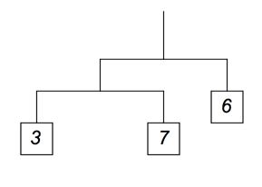

## 문제

모빌은 평형의 원리를 이용한 조각이다. 모빌은 여러 개의 막대와 물체로 이루어져 있다. 물체는 막대의 끝에만 매달려 있을 수 있고, 막대도 실을 이용해서 다른 막대의 끝에 연결할 수 있다.

막대가 다른 막대에 연결되어 있는 경우에는 매달려있는 막대의 중앙과 연결되어 있다. 아래 그림은 모빌의 예이다. 숫자는 물체의 무게를 나타낸다.

균형을 맞추지 않은 모빌이 주어졌을 때, 최소 물체 몇 개의 무게를 바꾸면 모빌이 균형을 이루는지 구하는 프로그램을 작성하시오.



물체의 무게는 임의의 음이 아닌 실수로 바꿀 수 있다. 위의 그림에서 무게 7인 물체의 무게를 3으로 바꾸면, 모빌이 균형을 이룬다. 따라서, 물체 1개만 무게를 바꾸면 된다.

## 입력

첫째 줄에 테스트 케이스의 수가 주어진다. 테스트 케이스는 최대 100개이다.

각 테스트 케이스는 한 줄로 이루어져 있고, 아래와 같이 재귀적으로 표현한다.

```

<expr> ::= <weight> | "[" <expr> "," <expr> "]"
```

<weight>는 양의 정수로 109보다 작은 양의 정수이다. [<expr>,<expr>]는 막대를 나타내 표현으로 두 표현은 막대의 양 끝을 나타낸다. 가장 위에 있는 막대와 가장 아래에 있는 막대 사이에 막대 개수 (두 막대 포함) 는 최대 16개이다.

## 출력

각 테스트 케이스 마다, 균형을 이루기 위해 무게를 바꿔야하는 물체의 최소 개수를 출력한다.
