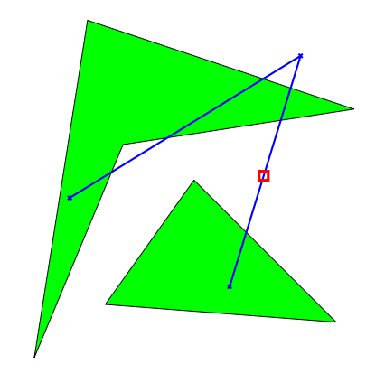

## 문제

Safety is an important issue when planning flights. First and foremost, one should of course take every possible measure to make sure that the trip is uneventful and that no incidents occur. But even then, one should always be prepared for the worst and try to make sure that if an incident does happen, people’s chances of surviving are as high as possible.

When making an emergency landing over water, the distance to the nearest land is a critical factor. In general, the further out on open waters, the worse are the odds of survival. Thus, one important safety parameter of a flight is how far away from the nearest land any part of the flight will take you. Your job is to write a program which, given a flight route, will determine this distance.

To simplify matters, we model the world as a 2-dimensional plane rather than a sphere. We model continents as polygons, and a flight route as a sequence of key points connected by straight line segments. Flight routes always start and end strictly inside a continent, but intermediate key points may be located over water. Continents do not intersect themselves or touch each other.

Second sample case (furthest point marked with a square).

## 입력

On the first line one positive number: the number of testcases, at most 100. After that per testcase:

* One line containing two integers C (1 ≤ C ≤ 20) and N (2 ≤ N ≤ 20), where C is the number of continents and N is the number of key points in the flight route.
* N lines each containing two integers X, Y giving the coordinates of the key points, from first to last.
* The descriptions of the C continents. Each continent description starts with a line containing an integer M (3 ≤ M ≤ 30) giving the number of vertices of this continent. It is followed by M lines, each containing a pair of integers X, Y giving the coordinates of the M vertices, in either clockwise or counter-clockwise order.

Every coordinate in the input is between −10 000 and 10 000.

## 출력

For each test case:

* One line with the furthest distance from land that the flight route will go. The answer should be given with an absolute or relative error of at most 10−3.
