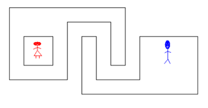

## 문제

선영이는 상근이를 만나러 가려고 한다. 두 사람이 사는 곳은 언덕진 곳이다. 선영이는 언덕을 걷는 것을 매우 싫어한다.

선영이는 두 사람이 살고있는 지역의 등고선 지도를 가지고 있다. 지도를 이용해 올라가야 하는 높이의 합과 내려가야 하는 높이의 합을 구해보려고 한다. 이때, 두 값을 최소로 해야 한다.

지도는 xy평면으로 나타낼 수 있고, 선영이의 집은 (0,0), 상근이의 집은 (100 000, 0)에 있다. 등고선은 다각형으로 나타낼 수 있으며, 다각형이 자기 자신이 교차하거나, 다른 다각형과 교차하는 경우는 없다. 또, 선영이와 상근이가 등고선 위에 살고있는 경우는 없다.

위의 그림은 두 번째 예제를 압축해서 그림으로 나타낸 것이다.

## 입력

첫째 줄에 테스트 케이스의 개수 T (≤ 100)가 주어진다. 각 테스트 케이스의 첫째 줄에는 등고선의 수 0 ≤ N ≤ 2,500 이 주어지며, 다음 줄부터 N개 줄에는 등고선의 정보가 주어진다. 첫 번째 숫자 Hi는 등고선의 높이 (1 ≤ Hi ≤ 1000) 이며, 두 번째 숫자 Pi는 다각형을 이루는 꼭짓점의 개수이다. (3 ≤ Pi ≤ 2000) 다음 숫자는 x1, y1, ..., xPi, yPi로 다각형의 꼭짓점을 나타내며, -300,000 ≤ xi, yi ≤ 300,000 을 만족하는 정수이다.

## 출력

각 테스트 케이스마다 올라가야 하는 높이의 합과 내려가야 하는 높이의 합을 출력한다.
