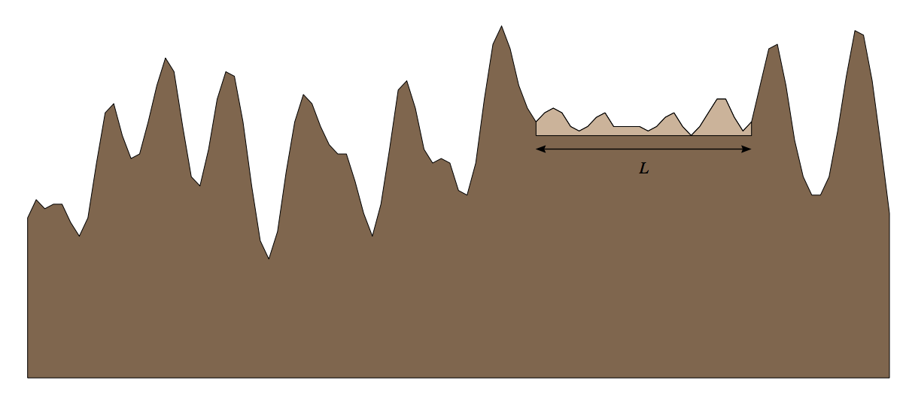

## 문제

Lineland is a strange country. As the name suggests, it’s shape (as seen from above) is just a straight line, rather than some two-dimensional shape. The landscape along this line is very mountainous, something which occasionally leads to some problems. One such problem now occurs: in this modern era the king wants to build an airport to stimulate the country’s economy. Unfortunately, it’s impossible for airplanes to land on steep airstrips, so a horizontal piece of land is needed. To accommodate for the larger airplanes, this strip needs to have length at least L.

Over the years, the inhabitants of Lineland have become very proficient in flattening pieces of land. Given a piece a land, they can remove rock quickly. They don’t want to add rock for that may lead to an unstable landing strip. To minimize the amount of effort, however, they want to remove the least amount of rock necessary to reach their goal: a flat piece of land of length L. What is this minimum amount? Because of the low-dimensional nature of Lineland, the amount of rock that needs to be removed is measured as the total area of land above the place where the landing strip is placed, rather than the volume (so in the Figure below, the amount of land removed is given by the lightly shaded area).

## 입력

One line with a positive number: the number of test cases (at most 25). Then for each test case:

* One line with an integer N, 2 ≤ N ≤ 500, the number of points, and an integer L, 1 ≤ L ≤ 10 000, the necessary length to flatten.
* N lines with two integers xi and yi with 0 ≤ xi, yi ≤ 10 000 describing the landscape of Lineland. The xi are in (strictly) ascending order. At position xi the height of the landscape is yi. Between two xi the landscape has constant slope. (So the landscape is piecewise linear). The difference between xN and x1 is greater than or equal to L.

## 출력

For each test case, output one line with the minimum amount of rock which must be removed in order to build the airport. The answer should be given as a floating point number with an absolute error of at most 10−3.
