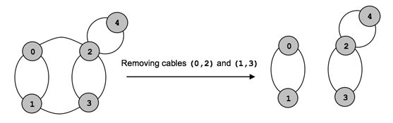

## 문제

The sites of a cable network are interconnected by cables such that a cable connects a single pair of distinct sites, and a pair of sites can be connected by several cables. We say that the network is connected if any two sites in the network are directly or indirectly connected; otherwise the network is disconnected. The safety grade S of the network is defined as follows.

* S is 0 if the network is disconnected, or the number of sites is 0 or 1.
* If the number of sites is greater than 1 then S is the minimum number of cables that disconnect the network when removed, i.e. removing any S-1 cables keeps the net connected, while the removal of some S cables disconnects the net.

For example, consider the net in figure 1, where the sites correspond to the shadowed circles and the cables are indicated by lines. The network stays connected when removing any single cable, whereas the removal of cables (0,2), and (1,3) disconnects the net. Another variant for disconnecting the net is by removing the cables (2,4) and (2,4). The safety grade is S=2.

Write a program that reads several data sets from a text file and computes the safety grade of the cable networks the data sets encode.

## 입력

Each data set starts with two integers: the number 0≤n≤100 of sites in the net, and 0≤m≤1000 the number of cables in the net. Follow m data pairs (u,v), u<v, where u and v are site identifiers (integers from 0 to n-1). A pair (u,v) designates a cable that interconnects the sites u and v. The pairs may occur in any order. Except the (u,v) pairs, which do not contain white spaces, white spaces can occur freely in input. Input data terminate with an end of file and are correct.

## 출력

For each data set, the program prints on the standard output, from the beginning of a line, the safety grade of the encoded net.

## 힌트

An input/output sample is given in table 1. The first data set encodes an empty network. The second data set encodes a net with 2 sites and 1 cable. The third data set corresponds to a disconnected network with two sites. The fourth data set encodes the net shown in figure 1.
