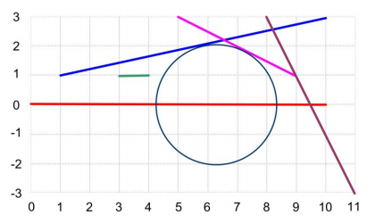

## 문제

이차원 평면에 N개의 선분이 있다. 이때, 다음 조건을 만족하는 가장 큰 비어있는 원을 구하는 프로그램을 작성하시오.

1. 원의 중심은 (xc, yc)
2. 0 ≤ xc ≤ L
3. yc = 0

비어있는 원은 어떤 선분과도 교차하지 않아야 한다. 단, 접하는 것은 괜찮다.

## 입력

첫째 줄에 테스트 케이스의 개수 T가 주어진다. 각 테스트 케이스는 다음과 같이 구성되어있다.

첫째 줄에 N과 L이 주어진다. (1 ≤ N ≤ 2000, 0 ≤ L ≤ 10000)

다음 N개의 줄에는 선분의 양 끝점을 나타내는 4개의 정수가 xa, ya, xb, yb 순서대로 주어진다. 즉, 선분의 양 끝점은 (xa, ya), (xb, yb) 이다. 모든 좌표는 -20000보다 크거나 같고, 20000보다 작거나 같다.

## 출력

각 테스트 케이스에 대해서, 가장 큰 원의 반지름을 소수점 셋째자리까지 출력한다.

## 힌트

