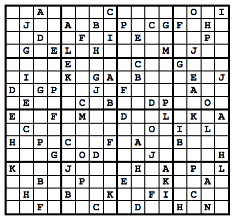
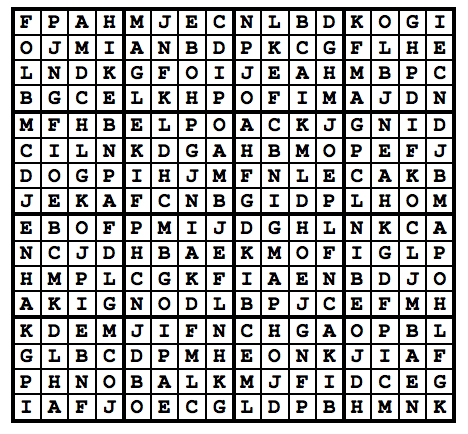

## 문제

스도쿠는 16\*16크기의 보드가 있을 때, 각 행과 각 열, 그리고 16개의 4\*4 크기의 보드에 A부터 P까지 알파벳 대문자를 중복 없이 나타나도록 보드를 채우면 된다.

왼쪽 그림은 스도쿠의 초기 상태, 오른쪽 그림은 스도쿠를 푼 상태이다.

스도쿠의 초기 상태가 주어졌을 때, 스도쿠를 푼 뒤 출력하는 프로그램을 작성하시오. 항상 답이 1개인 경우만 입력으로 주어진다.

## 입력

스도쿠 퍼즐의 초기 상태가 주어진다. 16개 줄에 걸쳐 16개 문자가 주어진다. 빈 칸은 -로 표시한다.

## 출력

스도쿠 퍼즐을 푼 뒤 출력한다.
