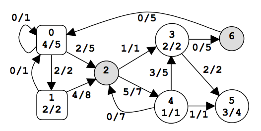

## 문제

A power network consists of nodes (power stations, consumers and dispatchers) connected by power transport lines. A node u may be supplied with an amount s(u)≥0 of power, may produce an amount 0 ≤ p(u) ≤ pmax(u) of power, may consume an amount 0 ≤ c(u) ≤ min(s(u),cmax(u)) of power, and may deliver an amount d(u) = s(u)+p(u)-c(u) of power. The following restrictions apply: c(u) = 0 for any power station, p(u) = 0 for any consumer, and p(u) = c(u) = 0 for any dispatcher. There is at most one power transport line (u,v) from a node u to a node v in the net; it transports an amount 0 ≤ l(u,v) ≤ lmax(u,v) of power delivered by u to v. Let Con = ∑uc(u) be the power consumed in the net. The problem is to compute the maximum value of Con.

| u | type | s(u) | p(u) | c(u) | d(u) |
| --- | --- | --- | --- | --- | --- |
| 0 | power station | 0 | 4 | 0 | 4 |
| 1 | 2 | 2 | 0 | 4 |
| 3 | consumer | 4 | 0 | 2 | 2 |
| 4 | 5 | 0 | 1 | 4 |
| 5 | 3 | 0 | 3 | 0 |
| 2 | dispatcher | 6 | 0 | 0 | 6 |
| 6 | 0 | 0 | 0 | 0 |

Figure 1. A power network

An example is in figure 1. The label x/y of power station u shows that p(u)=x and pmax(u)=y. The label x/y of consumer u shows that c(u)=x and cmax(u)=y. The label x/y of power transport line (u,v) shows that l(u,v)=x and lmax(u,v)=y. The power consumed is Con=6. Notice that there are other possible states of the network but the value of Con cannot exceed 6.

## 입력

There are several data sets in the input text file. Each data set encodes a power network. It starts with four integers: 0 ≤ n ≤ 100 (nodes), 0 ≤ np ≤ n (power stations), 0 ≤ nc ≤ n (consumers), and 0 ≤ m ≤ n2 (power transport lines). Follow m data triplets (u,v)z, where u and v are node identifiers (starting from 0) and 0 ≤ z ≤ 1000 is the value of lmax(u,v). Follow np doublets (u)z, where u is the identifier of a power station and 0 ≤ z ≤ 10000 is the value of pmax(u). The data set ends with nc doublets (u)z, where u is the identifier of a consumer and 0 ≤ z ≤ 10000 is the value of cmax(u). All input numbers are integers. Except the (u,v)z triplets and the (u)z doublets, which do not contain white spaces, white spaces can occur freely in input. Input data terminate with an end of file and are correct.

## 출력

For each data set from the input, the program prints on the standard output the maximum amount of power that can be consumed in the corresponding network. Each result has an integral value and is printed from the beginning of a separate line.
