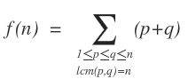

## 문제

창영이는 비밀번호를 만드는 함수가 있다.

이 함수의 뜻은 최소공배수가 n인 모든 쌍을 찾아, 그 합을 구하는 것이다.

예를 들어, 최소공배수가 6인 쌍은 5가지가 있다. (1, 6), (2, 6), (2, 3), (3, 6), (6, 6)

따라서 f(6)은 f(6) = (1+6) + (2+6) + (2+3) + (3+6) + (6+6) = 7+8+5+9+12 = 41 이 된다.

창영이의 온라인 저지 비밀번호를 만든 n이 주어졌을 때, 비밀번호를 구하는 프로그램을 작성하시오.

## 입력

첫째 줄에 테스트 케이스의 개수 T가 주어진다. (T ≤ 500)

각 테스트 케이스의 첫째 줄에는 C가 주어진다. (C ≤ 15) C는 n의 소인수의 개수이다.

다음 C개 줄에는 소인수 Pi와 그것의 개수 ai가 주어진다. (2 ≤ Pi ≤ 1000, Pi는 소수, 1 ≤ ai ≤ 50) 입력으로 주어지는 소수는 모두 서로 다르다.

## 출력

각 테스트 케이스에 대해서, 한 줄에 하나씩 f(n)값을 1000000007으로 나눈 나머지를 출력한다.
