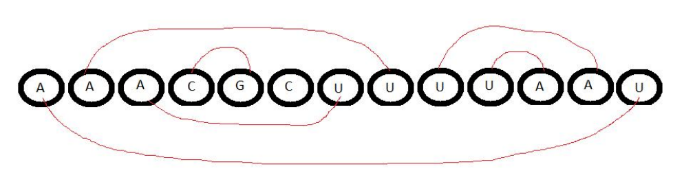

## 문제

A, C, G, U로 이루어진 문자열 S가 주어졌을 때, 만들 수 있는 짝의 개수 중에서 최댓값을 구하는 프로그램을 작성하시오.

짝은 다음과 같은 조건을 지켜야 한다.

1. A는 U의 짝을 지을 수 있다.
2. C는 G와 짝을 지을 수 있다.
3. 한 문자는 최대 한 개의 문자와 짝을 지을 수 있다.
4. w < x, y < z, w < y인 경우에, w번째 글자가 x번째 글자와 짝을 지었고, y번째 글자가 z번째 글자와 짝을 지었을 때, 다음 둘 중 하나의 조건이 참이 되어야 한다.
   * y > x
   * z < x
5. C와 G는 최대 K개만 짝을 지을 수 있다.

문자열 S가 RLE 인코딩한 형태로 주어졌을 때, 만들 수 있는 짝의 최대 개수를 구하는 프로그램을 작성하시오.

RLE 인코딩이란, 연속된 같은 문자가 몇 번 등장하는지 정수로 나타낸 인코딩을 의미한다. 예를 들어, "AAAACCGAAUUG"는 "A4C2G1A2U2G1"로 인코딩할 수 있다. 즉, <c1f1c2f2c3f3...cnfn>의 형태로 입력이 주어지며, ci는 A, C, G, U중 하나, fi는 양의 정수이다.

입력으로 주어지는 문자열은 다음과 같은 4가지 조건을 만족한다.

1. f1 + f2 + f3 + ...fn ≤ 10050
2. f1 ≤ 5000
3. fn ≤ 5000
4. f2 + f3 + f4 + . . . + fn − 1 ≤ 50

## 입력

첫째 줄에 테스트 케이스의 개수 T (T ≤ 200)가 주어진다. 첫째 줄에는 문자열 S가 RLE 인코딩한 형태로 주어지며, 둘째 줄에는 K (0 ≤ K ≤ 20)가 주어진다.

## 출력

각각의 테스트 케이스에 대해서, 만들 수 있는 짝의 최대 개수를 출력한다.

## 힌트

첫 번째 예제의 경우에 아래와 같이 6개의 짝을 만들 수 있다.

