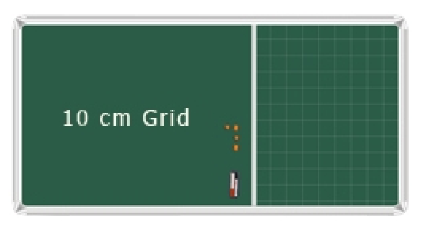

## 문제

I don’t know how you feel about your school time, but I become maudlin when I remember those days. One of our teachers told us at the final year that among all the educational institutions in life one misses his/her school days the most. And yes, I miss those days a lot.

Let me tell you that we had a grid board in our school and it was not as banal as it looks in the picture. The board was colorful and we also had different color chalks to use on it. Can you imagine how exciting it was for me when I first saw this board? In class break we used to draw on this board and play different games, few of them I can recall.

One of them was like this: firstly two players will mark some grid points. Then they will toss deciding who plays first. At each turn a player marks four points as A, B, C and D. Then join (A, B), (B, C), (C, D) and (D, A) to form a quadrilateral. Twice of the area of that quadrilateral is added to his score and the turn changes (in case, if you are wondering why twice, it is just to ensure that the score is always integer). A player can not draw a quadrilateral if it was drawn before. However, you can use previously used points. For example, suppose there are 5 points on the grid, P , Q, R, S and T. First player can choose, (A, B, C, D) = (P, Q, R, S), but then the second player can not choose (A, B, C, D) = (R, S, P, Q) because both of them depicts the same quadrilateral. If both of the players play optimally to maximize their own score I wonder what could be the sum of their scores.

So your task is to construe this game. You are given co-ordinates of N distinct points, if two players play the above mentioned game optimally then what is the sum of their scores?

## 입력

First line of the input data contains a positive integer T denoting the number of test cases (T ≤ 50).

For each case, first line contains a positive integer N (N ≤ 700). Hence follows N co-ordinates of the points (x, y). In case you don’t know, I should say: I am not from your time, I was brought here by a few scientists from future. And in my time we use huge boards so the absolute value of the co-ordinates can be as large as 106. Just to ensure that no one can draw a degenerate quadrilateral, no three points will be collinear.

## 출력

For each test case output the case number followed by sum of the scores. Since this score can be huge just print the answer mod 1000003.
