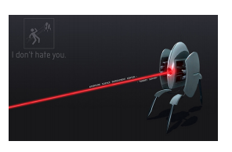

## 문제

We need to guard a set of points of interest using sentry robots that can not move or turn. We can position a sentry at any position facing either north, south, east or west. Once a sentry is settled, it guards the points of interest that are infront of it. If two or more points are in the same row or column a single robot can guard them all. Unfortunately, there are also some obstacles that the robot cannot see through.

From a set of points of interest and obstacles lying on a grid, calculate the minimum number of robots needed to guard all the points. In order to guard a point of interest, a robot must be facing the direction of this point and must not be any obstacles in between.

Given the following grid, where # represents an obstacle and \* a point of interest, the minimum number of robots needed is 2 (a possible position and orientation is shown using arrows for each robot).

Note that this is not the actual input or output, just a figure.

```

   Grid             Solution
. . . . . .        . . . . . .
. * # * . .        . * # * . .
. . # . . .        . . # . . .
. * # * . .        . ↑ # ↑ . .
```

For the following grid we need 4 robots because of the obstacles.

```

   Grid             Solution
. * * . .           . → * . .
. * # * .           . ↑ # ↑ .
. # * . .           . # ↓ . .
. . # . .           . . * . .
```

## 입력

The first line of the input has an integer C representing the number of test cases that follow. Before each test case there is an empty line.

For each case, the first line has 2 integers, Y and X, representing the height and width of the grid. The next line has an integer that indicates the number of points of interest P. The following P lines will have the positions py and px of the points of interest, one point per line. The next line has an integer that indicates the number of obstacles W. The following W lines will have the positions wy and wx of an obstacle, one per line.

## 출력

For each test case print the minimum number of robots needed to guard all the points of interest, one per line.

CONSTRAINTS

* 1 ≤ C ≤ 50
* 1 ≤ Y, X ≤ 100
* 0 ≤ P ≤ Y ∗ X
* 0 ≤ W ≤ Y ∗ X
* 0 ≤ P + W ≤ Y ∗ X
* 1 ≤ px, wx ≤ X
* 1 ≤ py, wy ≤ Y
