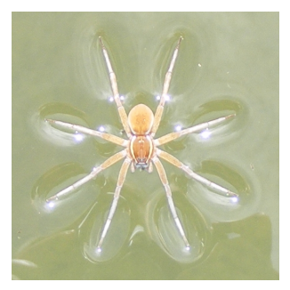

## 문제

Some types of spiders are able to walk on wa- ter. But spiders can have problems when walking near a waterfall.

Water in ponds or calm parts of rivers are suitable for spiders walking on water. When spiders realize water moves they jump in the opposite direction. However, the danger for spiders resides in the increasing speed of water as they move away from the area of calm waters. A spider is powerful enough to walk against the current if the water speeds is less than or equal to its jumping power P.

Waterfalls do a sharp increase in water speed, hence, whenever water just before the edge of a waterfall moves slower than the jumping power of a spider, the spider can’t detect the waterfall and may fall, because he thinks that can easily return to the zone of calm waters. If a spider is walking in a zone where the speed of water is higher than its jumping power, then the spider will fall.

Usually, the speed of water as it approaches to waterfalls doesn’t follow any pattern, but we have discovered that in some cases the water speed at distance m from calm waters depends linearly on the speed at m − 1 and m − 2. In such cases, we have measured the speed of the water at the first few meters, so the water speed at each point m up to the waterfall can be calculated.

We want to know the minimum distance to the waterfall that the spider can go and safely return.

## 입력

The input consists of several cases, one per line. Each case is defined by several integer numbers: D, P, S0, S1, S2, . . .

D is the distance in meters from calm waters to the waterfall (2 < D ≤ 10000). P is the jumping power of the spider (1 < P ≤ 1000). Remaining numbers in the line represent the speed of water as it approaches to the waterfall. S0 is the speed water moves in the area of calm waters, S1 is the speed at a distance of one meter from the area of calm waters, S2 is the speed at a distance of two meters from the area of calm waters, and so on. Depending on the case this sequence can be longer, maximum is D + 1 values. When the sequence of water speeds doesn’t follow a known pattern D + 1 values will be provided, otherwise a minimum of four numbers. All the sequences are nondecreasing sequences.

## 출력

The output will be an integer in a different line for each case indicating the minimum distance to the waterfall that the spider can be on water. If the jumping power of the spider is greater or equal than the water speed just before the waterfall then the output must be: ‘The spider may fall!’, because the spider cannot detect the waterfall. If the jumping power of the spider is lower than the water speed at any area of the pond or river the output must be: ‘The spider is going to fall!’.
