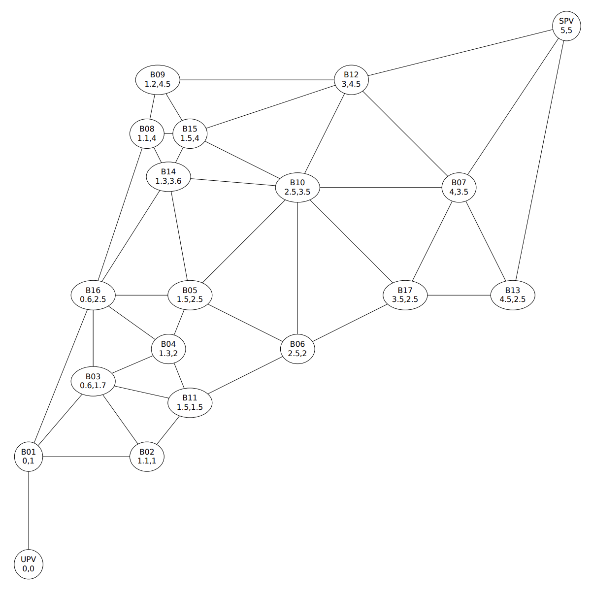

## 문제

It is well known that the Moon of Valencia is magical. Everyone talks about a mystery that happens at night. People remember what time they entered the first bar, what time arrived to the hotel and how happy they arrived, but nobody remembers the bars and pubs they visited.

The Valencia hotels have hired you for developing an application that helps customers to remember. The application will inform customers with one of all the possible sequences of bars and pubs. Customers have to provide the following information: departure time and place, arrival time and place, and degree of satisfaction on arrival.

The application uses a map with the location of each bar or pub. Each bar or pub produces a different degree of satisfaction when visited. But people gets angry when walks from one place to another, that’s the reason why walking between different places reduces the degree of satisfaction. The reduction considered depends on the amount of minutes people needs to get one place from another one. If the amount of minutes is not an integer the remaining seconds should be considered a portion of a minute, i.e., 30 seconds imply 0.5 minutes. People walk at a speed of 4 km/h, can stay in a bar or pub the time they like, but for getting the satisfaction must remain at least 15 minutes. People can decide not to visit a bar or pub, i.e., they can use a path from the origin to the target and to enter in a subset of all the bars or pubs reachable with the path. Entering to the departure place is optional, like entering others places. The goal grade of satisfaction is computed up to the door of the target place, without entering it. So the grade of satisfaction of the target place (bar, pub or hotel) should not be computed.

## 입력

Input consists of several test cases. Each case begins with the map description, which is followed by the list of arrivals your application have to check. The description of a map begins with the word MAP in capital letters followed by two integer numbers, P and M, where P is the number of places and M is the number of paths connecting two places. (1 ≤ P ≤ 64). Places and paths are described one per line. Each place is described with two coordinates (real numbers represent kilometers), its grade of satisfaction (a real number), the ID and the name. The paths connecting two places are identified by the their identifiers. Each pair of places can only be connected by one path.

Figure 1 shows the map corresponding to the first map in the example input case. It is guaranteed that no crossing paths exist

The list of arrivals to be processed begins after a line with the word ARRIVALS in uppercase. Each arrival is described in a single line, including departure time, departure place, arrival time, arrival place and the grade of satisfaction on arrival, a real number.

## 출력

The output for each case must begin with the word MAP in capital letters followed by a number indicating the number of test case. The first test case is MAP 1, second is MAP 2, and so on. For each arrival proposed in the input it must appear a line in the output specifying a valid path found or the string Impossible! indicating that it is not possible to find a path from origin to target with the required grade of satisfaction. A path found will be valid if the absolute difference between the required grade of satisfaction and the obtained one is less than 0.1, and contains no loops, i.e. a place can’t appear in the path found more than once.

Each path found must begin with the string PATH FOUND: in capital letters, followed by the obtained grade of satisfaction with three decimal digits and then the sequence of places from origin up to target. The ID of the unvisited places must appear preceded by the ! sign. Notice as the ID of the target place never is preceded by this sign.

Hint: set up your solution for running as fast as possible by using this example, it should be enough for all test cases.

## 힌트

Figure 1: Representation of the first map in the input example.
