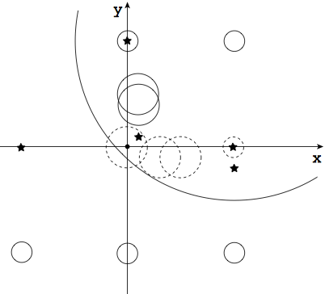

## 문제

Suppose that there are some light sources and many spherical balloons. All light sources have sizes small enough to be modeled as point light sources, and they emit light in all directions. The surfaces of the balloons absorb light and do not reflect light. Surprisingly in this world, balloons may overlap.

You want the total illumination intensity at an objective point as high as possible. For this purpose, some of the balloons obstructing lights can be removed. Because of the removal costs, however, there is a certain limit on the number of balloons to be removed. Thus, you would like to remove an appropriate set of balloons so as to maximize the illumination intensity at the objective point.

The following figure illustrates the configuration specified in the first dataset of the sample input given below. The figure shows the xy-plane, which is enough because, in this dataset, the z-coordinates of all the light sources, balloon centers, and the objective point are zero. In the figure, light sources are shown as stars and balloons as circles. The objective point is at the origin, and you may remove up to 4 balloons. In this case, the dashed circles in the figure correspond to the balloons to be removed.



Figure 1: First dataset of the sample input.

## 입력

The input is a sequence of datasets. Each dataset is formatted as follows.

```

N M R
S1x S1y S1z S1r
...
SNx SNy SNz SNr
T1x T1y T1z T1b
...
TMx TMy TMz TMb
Ex Ey Ez
```

The first line of a dataset contains three positive integers, N, M and R, separated by a single space. N means the number of balloons that does not exceed 2000. M means the number of light sources that does not exceed 15. R means the number of balloons that may be removed, which does not exceed N.

Each of the N lines following the first line contains four integers separated by a single space. (\(S\_{ix}\), \(S\_{iy}\), \(S\_{iz}\)) means the center position of the i-th balloon and \(S\_{ir}\) means its radius.

Each of the following M lines contains four integers separated by a single space. (\(T\_{jx}\), \(T\_{jy}\), \(T\_{jz}\) ) means the position of the j-th light source and \(T\_{jb}\) means its brightness.

The last line of a dataset contains three integers separated by a single space. (\(E\_{x}\), \(E\_{y}\),\(E\_{z}\)) means the position of the objective point.

\(S\_{ix}\), \(S\_{iy}\), \(S\_{iz}\), \(T\_{jx}\), \(T\_{jy}\), \(T\_{jz}\), \(E\_{x}\), \(E\_{y}\) and \(E\_{z}\) are greater than −500, and less than 500. \(S\_{ir}\) is greater than 0, and less than 500. \(T\_{jb}\) is greater than 0, and less than 80000.

At the objective point, the intensity of the light from the j-th light source is in inverse proportion to the square of the distance, namely

\[\frac{ T\_{jb} }{ (T\_{jx} - E\_{x})^2 + (T\_{jy} - E\_y)^2 + (T\_{jz} - E\_{z})^2}\]

if there is no balloon interrupting the light. The total illumination intensity is the sum of the above.

You may assume the following.

* The distance between the objective point and any light source is not less than 1.
* For every i and j, even if Sir changes by ε (|ε| < 0.01), whether the i-th balloon hides the j-th light or not does not change.

The end of the input is indicated by a line of three zeros.

## 출력

For each dataset, output a line containing a decimal fraction which means the highest possible illumination intensity at the objective point after removing R balloons. The output should not contain an error greater than 0.0001.
