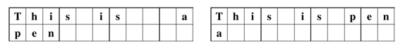
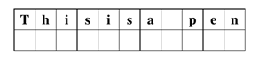
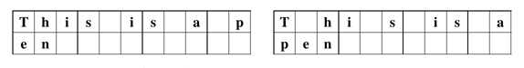
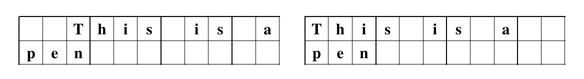
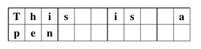

## 문제

글은 단어로 이루어져 있고, 단어는 글자로 이루어져 있다. 현수는 단어를 총 W열의 원고지에 써넣으려고 한다. (원고지의 행의 개수는 무한하다) 현수의 좌우명은 "보기 좋은 떡이 먹기도 좋다"이다. 따라서, 원고지에 글을 쓸 때, 항상 아래와 같은 규칙을 지킨다.

1. 글에 포함되어 있는 단어의 순서를 뒤섞으면 안 된다. 아래 그림 중 왼쪽 그림은 "This is a pen"을 11열 원고지에 작성할 때 올바른 예이고, 오른쪽 그림은 올바르지 않은 예이다. (단어의 순서를 섞었다)

2. 같은 줄에 있는 두 단어 사이에는 공백이 적어도 한 칸 있어야 한다. 아래 그림은 단어와 단어 사이에 공백을 넣지 않았기 때문에, 올바르지 않은 예이다.

3. 단어는 그 글자수만큼 연속된 칸을 차지해야 한다. 한 단어를 두 줄에 나누어서 쓸 수 없고, 단어 내에 공백이 들어 있으면 안 된다. 아래 예는 단어에 포함되어 있는 글자가 연속되지 않아서 현수의 규칙을 지키지 않는 예이다.

4. 글은 양 변에 대해서 균등 정렬이 되어야 한다. 즉, 각 줄의 첫 번째 단어는 첫 번째 열에서 시작해어야 하고, 마지막 줄을 제외한 모든 줄의 마지막 단어는 마지막 열에서 끝나야 한다. 아래 그림은 양 변에 대해서 균등하지 않은 예이다.

글은 불필요한 긴 공백이 없을 때 아름다운 레이아웃이라고 한다. 즉, 제일 긴 연속된 공백의 길이가 최소가 되어야 한다. 예를 들어, 아래 그림은 "This is a pen"을 11열 원고지에 쓸 때, 현수의 규칙을 지키면서 가장 아름다운 레이아웃이다. 제일 긴 연속된 공백의 길이가 2이다. 또, 1번 조건의 아래 왼쪽 그림은 3이다.

글과 원고지의 열의 개수가 주어진다. 이때, 현수의 규칙을 지키면서 이 글을 원고지에 쓸 때, 가장 아름다운 레이아웃의 제일 긴 연속된 공백의 길이를 구하는 프로그램을 작성하시오.

## 입력

입력은 여러 개의 테스트 케이스로 이루어져 있다.

각 테스트 케이스의 첫째 줄에는 W와 N이 주어진다. W는 원고지의 열의 개수이고, N은 글에 포함되어 있는 단어의 개수이다. (3 ≤ W ≤ 80,000, 2 ≤ N ≤ 50,000)

둘째 줄에는 단어의 길이 xi가 주어진다. xi는 i번째 단어의 길이이다. (1 ≤ xi ≤ (W-1)/2)

항상 문제의 조건을 만족하는 레이아웃이 존재한다.

입력의 마지막 줄에는 0이 두 개 주어진다.

## 출력

각 테스트 케이스에 대해서, 가장 아름다운 레이아웃의 제일 긴 연속된 공백의 길이를 출력한다.
