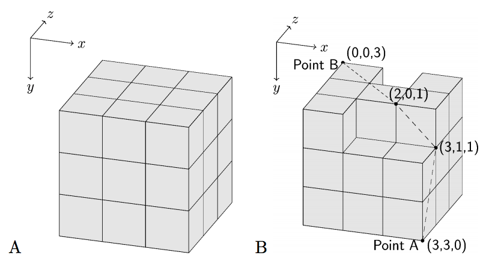
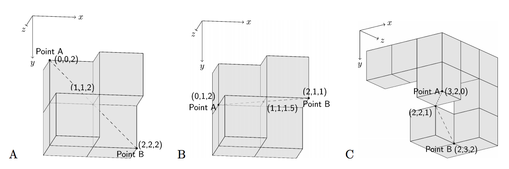

## 문제

In AD 3456, the earth is too small for hundreds of billions of people to live in peace. Interstellar Colonization Project with Cubes (ICPC) is a project that tries to move people on the earth to space colonies to ameliorate the problem. ICPC obtained funding from governments and manufactured space colonies very quickly and at low cost using prefabricated cubic blocks.

The largest colony looks like a Rubik’s cube. It consists of 3 × 3 × 3 cubic blocks (Figure J.1A). Smaller colonies miss some of the blocks in the largest colony.

When we manufacture a colony with multiple cubic blocks, we begin with a single block. Then we iteratively glue a next block to existing blocks in a way that faces of them match exactly. Every pair of touched faces is glued.



Figure J.1: Example of the largest colony and a smaller colony

However, just before the first launch, we found a design flaw with the colonies. We need to add a cable to connect two points on the surface of each colony, but we cannot change the inside of the prefabricated blocks in a short time. Therefore we decided to attach a cable on the surface of each colony. If a part of the cable is not on the surface, it would be sheared off during the launch, so we have to put the whole cable on the surface. We would like to minimize the lengths of the cables due to budget constraints. The dashed line in Figure J.1B is such an example. Write a program that, given the shape of a colony and a pair of points on its surface, calculates the length of the shortest possible cable for that colony.

## 입력

The input contains a series of datasets. Each dataset describes a single colony and the pair of the points for the colony in the following format.

```

x1 y1 z1 x2 y2 z2
b0,0,0 b1,0,0 b2,0,0
b0,1,0 b1,1,0 b2,1,0
b0,2,0 b1,2,0 b2,2,0
b0,0,1 b1,0,1 b2,0,1
b0,1,1 b1,1,1 b2,1,1
b0,2,1 b1,2,1 b2,2,1
b0,0,2 b1,0,2 b2,0,2
b0,1,2 b1,1,2 b2,1,2
b0,2,2 b1,2,2 b2,2,2
```

(x1, y1, z1) and (x2, y2, z2) are the two distinct points on the surface of the colony, where x1, x2, y1, y2, z1, z2 are integers that satisfy 0 ≤ x1, x2, y1, y2, z1, z2 ≤ 3. bi,j,k is ‘#’ when there is a cubic block whose two diagonal vertices are (i, j, k) and (i + 1, j + 1, k + 1), and bi,j,k is ‘.’ if there is no block. Figure J.1A corresponds to the first dataset in the sample input, whereas Figure J.1B corresponds to the second. A cable can pass through a zero-width gap between two blocks if they are touching only on their vertices or edges. In Figure J.2A, which is the third dataset in the sample input, the shortest cable goes from the point A (0, 0, 2) to the point B (2, 2, 2), passing through (1, 1, 2), which is shared by six blocks. Similarly, in Figure J.2B (the fourth dataset in the sample input), the shortest cable goes through the gap between two blocks not glued directly. When two blocks share only a single vertex, you can put a cable through the vertex (Figure J.2C; the fifth dataset in the sample input).

You can assume that there is no colony consisting of all 3 × 3 × 3 cubes but the center cube.

Six zeros terminate the input.



Figure J.2: Dashed lines are the shortest cables. Some blocks are shown partially transparent for illustration.

## 출력

For each dataset, output a line containing the length of the shortest cable that connects the two given points. We accept errors less than 0.0001. You can assume that given two points can be connected by a cable.
