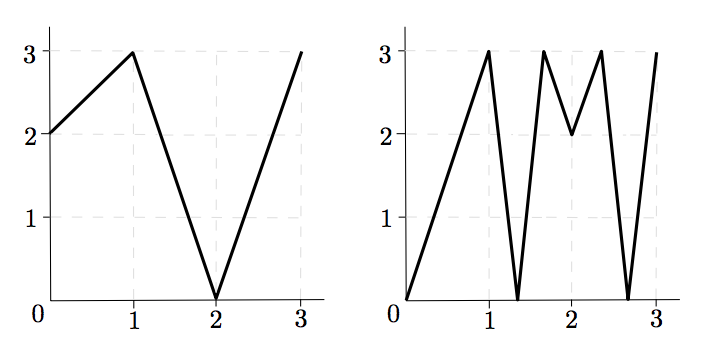

## 문제

Computing the number of fixed points and, more generally, the number of periodic orbits within a dynamical system is a question attracting interest from different fields of research. However, dynamics may turn out to be very complicated to describe, even in seemingly simple models. In this task you will be asked to compute the number of periodic points of period \(n\) of a piecewise linear map \(f\) mapping the real interval \(\left[ 0, m \right]\) into itself. That is to say, given a map \(f : \left[ 0, m \right] \rightarrow  \left[ 0, m \right]\) you have to calculate the number of solutions to the equation \(f^n(x) = x\) for \(x \in \left[ 0, m \right] \), where \(f^n\) is the result of iterating function \(f\) a total of \(n\) times, i.e.

\[f^n =\overbrace { f \circ \cdots  \circ  f \circ f  }  ^ {\text{n f's}}, \]

where \(\circ\) stands for the composition of maps, \((g \circ h)(x) = g(h(x))\).

Fortunately, the maps you will have to work with satisfy some particular properties:

* \(m\) will be a positive integer and the image of every integer in \(\left[ 0, m \right]\) under \(f\) is again an integer in \(\left[ 0, m \right]\), that is, for every \(k \in \left\{0, 1, \dots , m \right\}\) we have that \(f(k) \in \left\{0, 1, \dots , m \right\}\).
* For every \(k \in \left\{0, 1, \dots , m − 1 \right\}\), the map f is linear in the interval \(\left[ k, k+1 \right] \). This means that for every \(x \in \left[ k, k+1 \right] \), its image satisfies \(f(x) = (k + 1 − x)f(k) + (x − k)f(k + 1)\), which is equivalent to its graph on \(\left[ k, k+1 \right]\)  being a straight line segment.

Figure 1: Graphs of the third map in the sample input, \(f\_3\) (left), and of its square, \(f^2\_3\) (right).

Since there might be many periodic points you will have to output the result modulo an integer.

## 입력

The input consists of several test cases, separated by single blank lines. Each test case begins with a line containing the integer \(m\) (1 ≤ \(m\) ≤ 80). The following line describes the map \(f\); it contains the \(m\)+1 integers \(f(0), f(1), \dots , f(m)\), each of them between 0 and \(m\) inclusive. The test case ends with a line containing two integers separated by a blank space, \(n\) (1 ≤ \(n\) ≤ 5 000) and the modulus used to compute the result, mod (2 ≤ mod ≤ 10 000).

The input will finish with a line containing 0.

## 출력

For each case, your program should output the number of solutions to the equation \(f^n(x) = x\) in the interval \(\left[ 0, m \right]\) modulo mod. If there are infinitely many solutions, print Infinity instead.
