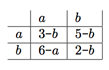

## 문제

현종이는 공장 노동자이다. 부푼 꿈을 안고 입사해 20년간 일해왔으나, 만일 이번 달에 생산 효율이 증가하지 않는다면 다음 달에 해고될 것이라는 청천벽력같은 소식을 듣고 말았다. 현종이의 일은 간단하다. 주어진 순서대로 조각을 조립하여 제품을 제작하면 된다. 하지만 조각 a, b, c를 조립할 때, a-b 를 조립한 뒤 c를 이어붙이는 것과 b-c를 조립한 뒤 a를 이어붙이는 데에 걸리는 시간이 다르다. 현종이는 아마 이 공정을 효율적으로 개선하면 공장 일을 계속할 수 있을 것이라 판단했다.

현종이를 돕기 위해, 당신은 모든 조각을 조립하는 최적의 방법을 알려주는 프로그램을 작성하면 된다. 프로그램의 첫 줄에 조각의 목록이 주어진 뒤, 그 다음 줄부터 조각을 이어붙이는 데에 걸리는 시간과 그 결과물이 표 형태로 주어진다.

예제는 다음과 같다.

a와 a를 이어붙이는 데엔 3의 시간이 걸리고, 그 결과는 부품 b가 된다. 그리고 이것의 뒤에 다시 a를 이어붙이는 데엔 6의 시간이 걸릴 것이다. 표는 대칭이 아닐 수 있다. b-a를 조립하는 시간과 a-b를 조립하는 시간이 다를 수 있다는 의미이다.

만일 만들고자 하는 완성품이 aba라면, 두 가지 가능한 경우는 다음과 같다.

* (ab)a = ba = a , 걸리는 시간 = time(ab) + time(ba) = 5 + 6 =11
* a(ba) = aa = b , 걸리는 시간 = time(ba) + time(aa) = 6 + 3 = 9

따라서 출력은 9-b가 될 것이다.

## 입력

입력은 여러 개의 테스트 케이스로 이루어져 있다.

각 테스트 케이스의 첫 줄엔 자연수 k ( 1 ≤ k ≤ 26 ) 이 주어지며, 그 다음 줄엔 공백으로 구분되어 조각의 이름들이 주어진다. ( [a-z] 에 포함되는 알파벳 ).

다음 k개의 줄엔 생산 공정 표가 주어진다. 각 줄은 k개의 문자열로 이루어져 있으며, i행 j열의 값은 i번째 부품을 j번째 부품과 조립하는 데에 걸리는 시간과 결과물을 나타낸다. 조립에 걸리는 시간은 0 이상 1000000 이하의 정수이며, 결과물로 잘못된 문자가 주어지는 경우는 없다.

그 다음 줄엔 정수 n이 주어지며, 만들고자 하는 완성품의 개수이다.

다음 n줄엔 완성품의 형태가 주어진다.

각 완성품은 200개 이하의 부품으로 이루어져 있으며, 주어진 형태를 변경하여 조립할 수는 없다.

k=0일 경우 프로그램을 종료하며 이 경우엔 아무 것도 출력하지 않는다.

## 출력

각 테스트 케이스에 대해, 각 완성품을 가장 빨리 만들 수 있는 경우에 걸리는 시간과 그 때의 결과물을 time-result 의 형태로 한 줄에 하나씩 출력한다. 만일 그러한 것이 여러 가지라면 결과물이 처음 주어진 부품의 목록에서 더 먼저 등장한 것을 출력한다. 예를 들어, 결과로 5-b와 5-c가 가능하며, 테스트 케이스의 두 번째 줄에서 입력받은 부품의 목록이 a c b 였다면 5-c를 출력하면 된다.

각 테스트 케이스의 사이엔 빈 줄을 하나 출력한다.
