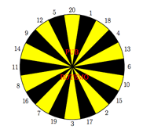

## 문제

After a long week of work at the ICPC Headquarters, Bill and his friends usually go to a small pub on Friday evenings to have a couple of beers and play darts. All of them are well aware of the fact that their ability at darts decreases at the same rate as the amount of beer left in their mugs.

They always play 501, one of the easiest games. Players start with a score of N points (typically, N = 501, hence the name) and take turns throwing darts. The score of each player decreases by the value of the section hit by the dart, unless the score becomes negative, in which case it remains unchanged. The first player to reach a score of 0 wins. The figure below shows the dartboard with which the game is played.

Figure 1: Dartboard

As the clock ticks closer to midnight and they start running out of beer, everyone wonders the same: is it worth trying to aim the dart at a specific section? Or is it better just to throw the dart at a random section on the dartboard? You are asked to deal with the question by finding out what would happen if two players (A and B) applying these two different strategies were to play against each other:

Player A throws the darts at random, and consequently they land with equal probability in each of the sections of the dartboard.  
If Player B aims at a certain section, the dart has the same probability of landing in the correct one as in each of the two adjacent ones (the neighbouring regions to the left and right). Moreover, he is completely aware of his ability and sober enough to aim at the section that maximizes his probability of winning.

Given the initial score of both players, can you determine the probability that the first player wins? Of course, being the first to throw a dart might be advantageous, so the answer depends on who plays first.

## 입력

The input consists of a series of lines, each containing an integer N (1 ≤ N ≤ 501), the initial score of both players. A case with N = 0 marks the end of the input and must not be processed.

## 출력

For each number in the input, your program should output a line containing two real numbers: the probability that A wins if A throws the first dart, and the probability that B wins if B throws the first dart. Your answers should be accurate to within an absolute or relative error of 10−8.
