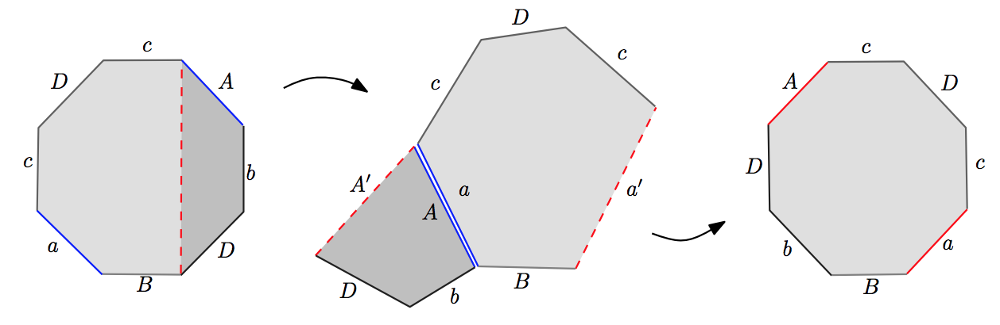

## 문제

A colony of alien bacteria has recently been discovered close to a crater in New Mexico. Dr. Poucher is in charge of the scientific team at the ICPC BioLab committed to the study of the alien DNA structure. We briefly sketch their discoveries here.

Alien DNA molecules have the structure of a circular sequence. Each sequence is composed of nucleotides. There are 26 different types of nucleotides, and each of them can occur in two faces. It is very important to remark that in any given alien DNA molecule, every nucleotide either does not appear at all or appears exactly twice (hence, the length of a DNA molecule is an even integer between 2 and 52). In case a nucleotide occurs twice, each occurrence can be of either type independently. Alien bacteria have two types of extremities, which in the technical biological jargon are referred to as arms and legs. A major discovery of Dr. Poucher’s team is a method to determine the exact number of arms and legs of a bacterium by examining its DNA structure.

Here we represent each nucleotide as a letter of the alphabet. We refer to the different nucleotides as \(\text{a}, \text{A}, \dots \text{z}, \text{Z}\), where the lowercase and uppercase forms of a letter represent the two possible faces a nucleotide may appear with; we shall also use \(a/A, b/B, \dots z/Z\) to refer to a nucleotide in either face.

To determine the number of extremities, Dr. Poucher starts by initializing two counters of arms and legs to zero, and then proceeds to perform a number of surgeries, transforming a DNA sequence into another one. After each transformation, you may need to increase some of the counters, depending on the type of surgery applied. When the empty sequence of nucleotides (which will be denoted by \(\emptyset\)) has been reached, the number of extremities of the original molecule has been found. The possible surgeries are:

1. Eliminate consecutive instances of a given nucleotide appearing with opposite faces. The number of arms and legs is preserved. For example: \(\text{aBbCaC} \rightarrow \text{aCaC}\) by eliminating \(\text{Bb}\). Another example: \(\text{DeHhEd} \rightarrow \text{eHhE}\) by eliminating \(\text{dD}\). Remember that DNA structure is circular, so in our representation as a string the last and first letters are connected.
2. Eliminate consecutive nucleotides appearing with the same face. Add one to the number of arms. For example: \(\text{BBcgCg} \rightarrow \text{cgCg}\) by eliminating \(\text{BB}\). Another example: \(\text{xabyyaBX} \rightarrow \text{xabaBX}\) by eliminating \(\text{yy}\).
3. Eliminate a sequence of four nucleotides formed by two different nucleotides that appear alternately where different occurrences of the same nucleotide have opposite faces. Add one to the number of legs. For example: \(\text{dcDCefFe} \rightarrow \text{efFe}\), by eliminating \(\text{dcDC}\). Another example: \(\text{cmNMnC} \rightarrow \text{cC}\) by eliminating \(\text{mNMn}\).
4. Cut and paste, the most sophisticated procedure. First, a nucleotide is selected, for instance \(a/A\), and the DNA sequence is chopped into two linear chains such that the nucleotide appears once in each of them.  
   Second, if both occurrences of \(a/A\) are of the same face, one of the chains is “inverted” by reversing the sequence and changing the face of every nucleotide in the chain.  
   Then, the chains are combined by concatenating the subsequence occurring before \(\text{a}\) with the subsequence occurring after \(\text{A}\), and the subsequence occurring after \(\text{a}\) with the sub-sequence occurring before \(\text{A}\).  
   Finally, two new \(a/A\) nucleotides are added to close the chain into a circular shape. The face of the new nucleotides are the same if the original pair of nucleotides selected had the same face, and is different otherwise.  
   Formally, suppose you select the nucleotide \(a/A\), and further assume for the moment that it appears both times with the face \(\text{a}\) (\(\text{A}\)). The cut and paste surgery turns sequences of the form \(S\_1\text{a}S\_2S\_3\text{a}S\_4\) (respectively \(S\_1\text{A}S\_2S\_3\text{A}S\_4\)) into \(S\_2\text{a}S\_1\bar{S}\_3\text{a}\bar{S}\_4\) (respectively \(S\_2\text{A}S\_1\bar{S}\_3\text{A}\bar{S}\_4\)). On the other hand, if nucleotide \(a/A\) appears with its two different faces, the surgery turns seqences of the form \(S\_1\text{a}S\_2S\_3\text{A}S\_4\) into \(S\_2\text{a}S\_1S\_4\text{A}S\_3\). \(S\_1\), \(S\_2\), \(S\_3\) and \(S\_4\) are arbitrary sub-chains (possibly empty). In both cases the original circular chain was chopped into \(S\_1(a/A)S\_2\) and \(S\_3(a/A)S\_4\).  
   For example (see the figure below): starting with the sequence \(\text{BacDcAbD}\), we can get chains \(\text{BacDc}\) and \(\text{AbD}\). Then, merging at nucleotide \(a/A\) we get the sequence \(\text{cDca’BbDA’}\) where \(\text{a’}\) and \(\text{A’}\) represent the new \(a/A\) nucleotides. Here, \(S\_1 = \text{B}\), \(S\_2 = \text{cDc}\), \(S\_3 = \emptyset\) and \(S\_4 = \text{bD}\).  
   Another example: take the same DNA sequence \(\text{BacDcAbD}\), and cut to get the chains \(\text{DBac}\) and \(\text{DcAb}\); paste nucleotide \(c/C\) (in this case you need to reverse one chain, for example \(\text{BaCd}\)) to get the sequence \(\text{cDBadcBa}\). Here, \(S\_1 = \text{DBa}\), \(S\_2 = \emptyset\), \(S\_3 = \text{D}\) and \(S\_4 = \text{Ab}\).  
     
   This surgery does not modify the number of arms or legs, but can be used cleverly in combination with the previous surgeries to reduce the size of the DNA molecule and finish the calculation.

However, alien bacteria do not present both arms and legs at the same time. This is due to the fact that, in their early development, a leg, in the presence of one or more arms, becomes two arms. Because of the above, the end result is either a number of arms or a number of legs, but not both at the same time. In order to avoid expensive surgical procedures, Dr. Poucher has hired you to write a program that computes the number of arms and legs a bacterium will develop, given its DNA sequence. It is guaranteed that the result is determined uniquely by the original string, regardless of the particular sequence of surgeries applied.

## 입력

Each test case consists of a string of even length between 2 and 52, inclusive, representing the DNA structure of an alien bacterium. All characters are letters. There will be one case per line in the input. The last line contains the word “END” and must not be processed.

## 출력

The output for each test case should have exactly one line, containing the number of arms or legs the bacterium will have, followed by the word “arms” or “legs” respectively (if the number is 1, the words should be in singular). In case there will be neither arms nor legs, the program should print the word “none”.
