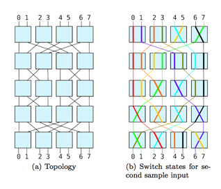

## 문제

You work as an engineer for the Inane Collaboration for Performance Computing, where you are in charge of designing an intercommunication network for their computers. The network is arranged as a rectangular array of 2n-1 rows, each having 2n-1 switches. A switch is a device with two input wires, X and Y , and two output wires, X' and Y'. If the switch is o , data from input X will be relayed to output X', and data from Y to Y'. If it is on, X will be connected to Y' and Y to X'. Additionally, there are 2n computers in the topmost and bottommost rows, and messages need to be sent between pairs of them. Notice that data from two different sources cannot share a wire but, of course, both pieces of data can be routed through the same switch on different inputs.

You have come to the conclusion that the network that best suits your purposes has the Beneš topology. A 1-Beneš network is just a switch. For n > 1, a n-Beneš network can be constructed recursively as follows:

* In the first (top) row there are 2n-1 switches such that switch j (0 ≤ j < 2n-1) has data inputs from computers 2j and 2j+1 (we label the computers in the topmost and bottommost rows with integers between 0 and 2n-1, inclusive, from left to right).
* Then a perfect shuffle permutation is applied to the output wires between the first and the second rows of switches, meaning that output number j in a row is connected to input number j' in the next row, where j' is obtained by rotating the n-bit pattern representing j in binary one bit to the right (again, inputs and outputs are numbered from left to right).
* If n > 2, the next rows of switches, up to (and including) the last-but-one, form two (n-1)-Beneš subnetworks, one of the left side and the other on the right side.
* Finally, the inverse shuffle permutation is applied to the outputs and a last row of switches is added.

Figure 4: 3-Beneš network

For example, Figure 4 shows the Beneš network for n = 3 (squares represent switches, computers in the top and bottom rows are not drawn, but assigned with integers from 0 to 7). Figure 4 shows a possible state of the switches, squares where two of the lines cross are switches that have been turned on. You may verify that this state allows us to simultaneously establish communication paths from computers 0,1,2,3,4,5,6,7 at the bottom to 3,7,4,0,2,6,1,5 at the top, respectively.

You are given a set of pairs (a, b) of computers to connect simultaneously (where a is a computer in the bottom row and b a computer in the top row) by means of wire-disjoint paths, and you are to find how to select the state of all switches so that this can be accomplished.

## 입력

The first line of each test case is an integer n (1 ≤ n ≤ 13), meaning that you have 2n pairs of computers to connect, as described above. A line with n = 0 marks the end of the input and should not be processed.

Each line with n > 0 will be followed by another line containing 2n integers. The i-th integer (0 ≤ i < 2n) will be the computer in the topmost row that the i-th computer in the bottommost row needs to communicate with.

## 출력

The output for each case should have 2n-1 lines, each containing a binary string of length 2n-1 indication, for each switch, whether it must be turned on (1) or off (0).

The input given will always have at least one solution. In case of several solutions, return the lexicographically smallest one. That is, the string in the top row must be lexicographically smallest; in case of a tie, the string in the second row must be lexicographically smallest, and so on.

Outputs for different test cases should be separated by a blank line.
