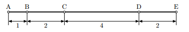
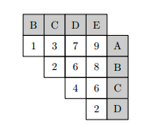

## 문제

고속도로 위에 마을 여러 개가 있다. 이 고속도로에는 분기점이 없다. 모든 인접한 마을의 거리가 주어졌을 때, 이 거리를 이용해서 모든 마을사이의 거리를 구할 수 있다. 예를 들어, 아래와 같이 5개의 마을 (A, B, C, D, E)가 있고, 인접한 마을 간의 거리가 아래 그림과 같다. 그럼, 이 거리를 이용해서 전체 마을 간의 거리 행렬을 그릴 수 있다.

위의 행렬과 같이 N(N-1)/2 거리가 모두 주어진다. 이때, 마을의 순서를 결정하고, 인접한 마을 간의 거리를 구하는 프로그램을 작성하시오.

## 입력

입력은 여러 개의 테스트 케이스로 이루어져 있다. 테스트 케이스의 첫째 줄에는 마을의 수 N (2 ≤ N ≤ 20)이 주어진다. 다음 줄에는 모든 마을 간의 거리 N(N-1)/2개의 정수가 공백이나 빈 줄로 구분되어 주어진다. 숫자는 감소하는 순서로 주어진다. 거리는 1보다 크거나 같고, 400보다 작거나 같은 자연수이며, 가장 긴 거리는 가장 왼쪽 마을과 오른쪽 마을 간의 거리이다.

마지막 줄에는 0이 하나 주어진다.

## 출력

각 테스트 케이스에 대해서, N-1개의 정수를 출력한다. 이 정수는 인접한 마을 간의 거리이다. 숫자는 모두 공백으로 구분하여야 한다. 만약, 정답이 여러 가지인 경우에는 거리를 수열로 생각하여 사전 순으로 모두 한 줄에 하나씩 출력한다. 가능한 정답이 없는 경우에는 아무것도 출력하지 않으면 된다. 테스트 케이스에 해당하는 모든 정답을 출력하고 난 후에는 '-----'을 출력한다.
