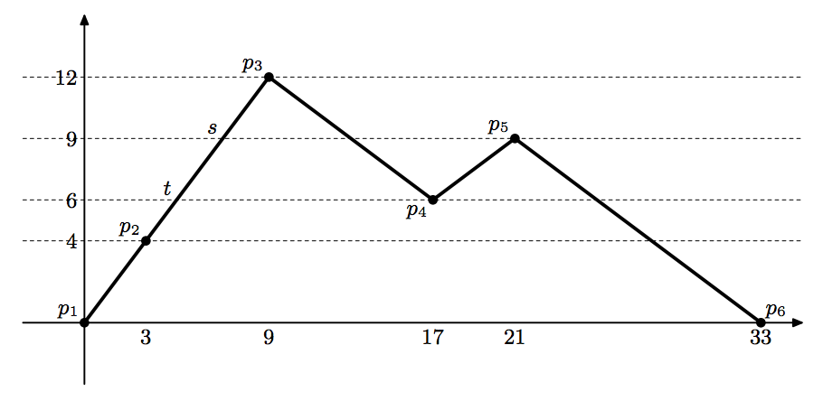

## 문제

Two experienced climbers are planning a first-ever attempt: they start at two points of the equal altitudes on a mountain range, move back and forth on a single route keeping their altitudes equal, and finally meet with each other at a point on the route. A wise man told them that if a route has no point lower than the start points (of the equal altitudes) there is at least a way to achieve the attempt. This is the reason why the two climbers dare to start planning this fancy attempt.

The two climbers already obtained altimeters (devices that indicate altitude) and communication devices that are needed for keeping their altitudes equal. They also picked up a candidate route for the attempt: the route consists of consequent line segments without branches; the two starting points are at the two ends of the route; there is no point lower than the two starting points of the equal altitudes. An illustration of the route is given in Figure E.1 (this figure corresponds to the first dataset of the sample input).

Figure E.1: An illustration of a route

The attempt should be possible for the route as the wise man said. The two climbers, however, could not find a pair of move sequences to achieve the attempt, because they cannot keep their altitudes equal without a complex combination of both forward and backward moves. For example, for the route illustrated above: a climber starting at p1 (say A) moves to s, and the other climber (say B) moves from p6 to p5; then A moves back to t while B moves to p4; finally A arrives at p3 and at the same time B also arrives at p3. Things can be much more complicated and thus they asked you to write a program to find a pair of move sequences for them.

There may exist more than one possible pair of move sequences, and thus you are requested to find the pair of move sequences with the shortest length sum. Here, we measure the length along the route surface, i.e., an uphill path from (0, 0) to (3, 4) has the length of 5.

## 입력

The input is a sequence of datasets.

The first line of each dataset has an integer indicating the number of points N (2 ≤ N ≤ 100) on the route. Each of the following N lines has the coordinates (xi, yi) (i = 1, 2,...,N) of the points: the two start points are (x1, y1) and (xN, yN); the line segments of the route connect (xi, yi) and (xi+1, yi+1) for i = 1, 2,...,N − 1. Here, xi is the horizontal distance along the route from the start point x1, and yi is the altitude relative to the start point y1. All the coordinates are non-negative integers smaller than 1000, and inequality xi < xi+1 holds for i = 1, 2,...,N − 1, and 0 = y1 = yN ≤ yi for i = 2, 3,...,N − 1.

The end of the input is indicated by a line containing a zero.

## 출력

For each dataset, output the minimum sum of lengths (along the route) of move sequences until the two climbers meet with each other at a point on the route. Each output value may not have an error greater than 0.01.
