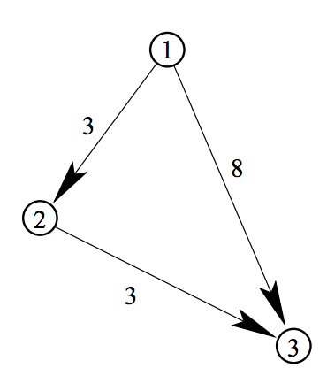
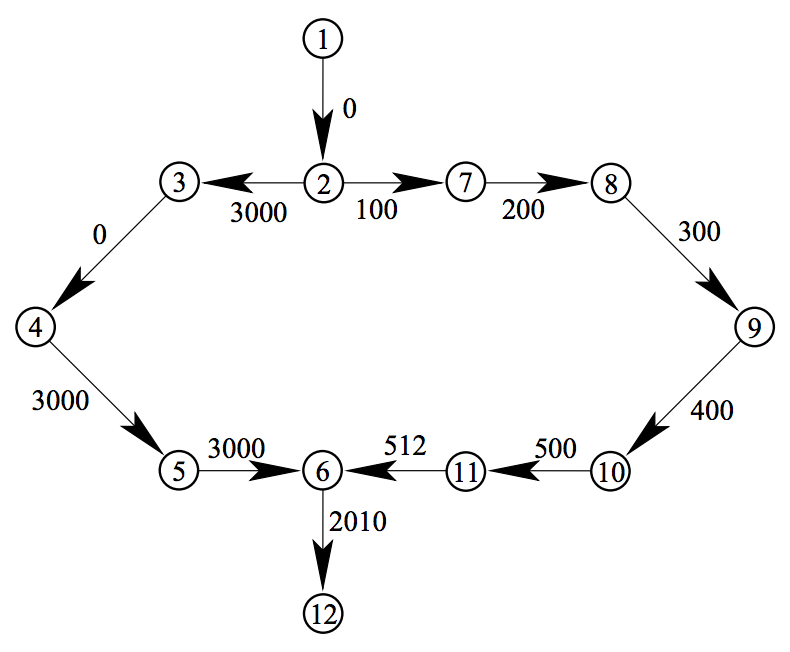

## 문제

You are a judge of a programming contest. You are preparing a dataset for a graph problem to seek for the cost of the minimum cost path. You’ve generated some random cases, but they are not interesting. You want to produce a dataset whose answer is a desired value such as the number representing this year 2010. So you will tweak (which means ‘adjust’) the cost of the minimum cost path to a given value by changing the costs of some edges. The number of changes should be made as few as possible.

A non-negative integer c and a directed graph G are given. Each edge of G is associated with a cost of a non-negative integer. Given a path from one node of G to another, we can define the cost of the path as the sum of the costs of edges constituting the path. Given a pair of nodes in G, we can associate it with a non-negative cost which is the minimum of the costs of paths connecting them.

Given a graph and a pair of nodes in it, you are asked to adjust the costs of edges so that the minimum cost path from one node to the other will be the given target cost c. You can assume that c is smaller than the cost of the minimum cost path between the given nodes in the original graph.

For example, in Figure G.1, the minimum cost of the path from node 1 to node 3 in the given graph is 6. In order to adjust this minimum cost to 2, we can change the cost of the edge from node 1 to node 3 to 2. This direct edge becomes the minimum cost path after the change.

For another example, in Figure G.2, the minimum cost of the path from node 1 to node 12 in the given graph is 4022. In order to adjust this minimum cost to 2010, we can change the cost of the edge from node 6 to node 12 and one of the six edges in the right half of the graph. There are many possibilities of edge modification, but the minimum number of modified edges is 2.



Figure G.1: Example 1 of graph



Figure G.2: Example 2 of graph

## 입력

The input is a sequence of datasets. Each dataset is formatted as follows.

```

n m c
f1 t1 c1
f2 t2 c2
.
.
.
fm tm cm
```

The integers n, m and c are the number of the nodes, the number of the edges, and the target cost, respectively, each separated by a single space, where 2 ≤ n ≤ 100, 1 ≤ m ≤ 1000 and 0 ≤ c ≤ 100000.

Each node in the graph is represented by an integer 1 through n.

The following m lines represent edges: the integers fi, ti and ci (1 ≤ i ≤ m) are the originating node, the destination node and the associated cost of the i-th edge, each separated by a single space. They satisfy 1 ≤ fi, ti ≤ n and 0 ≤ ci ≤ 10000. You can assume that fi ≠ ti and (fi, ti) ≠ (fj, tj) when i = j.

You can assume that, for each dataset, there is at least one path from node 1 to node n, and that the cost of the minimum cost path from node 1 to node n of the given graph is greater than c.

The end of the input is indicated by a line containing three zeros separated by single spaces.

## 출력

For each dataset, output a line containing the minimum number of edges whose cost(s) should be changed in order to make the cost of the minimum cost path from node 1 to node n equal to the target cost c. Costs of edges cannot be made negative. The output should not contain any other extra characters.
