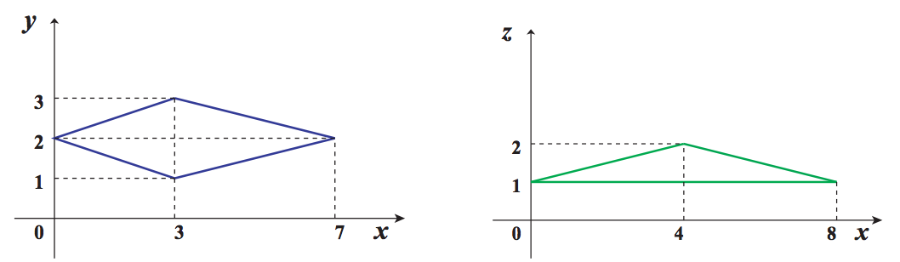
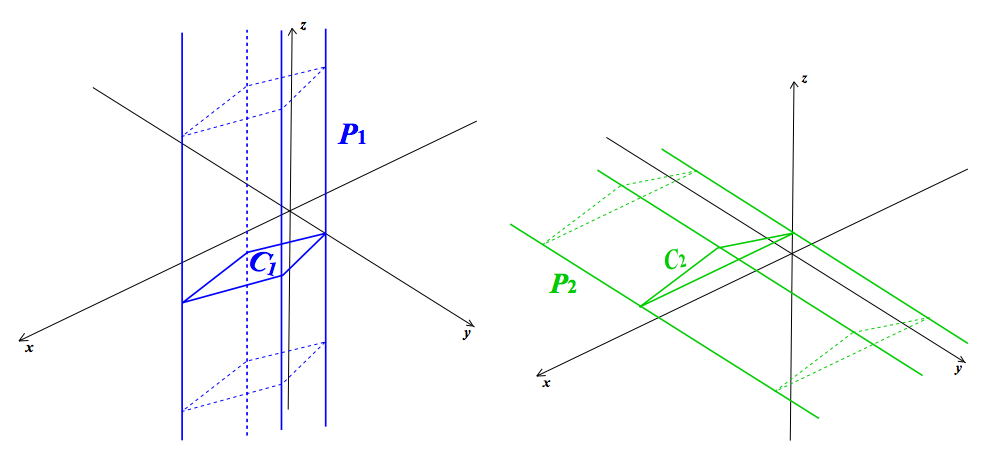
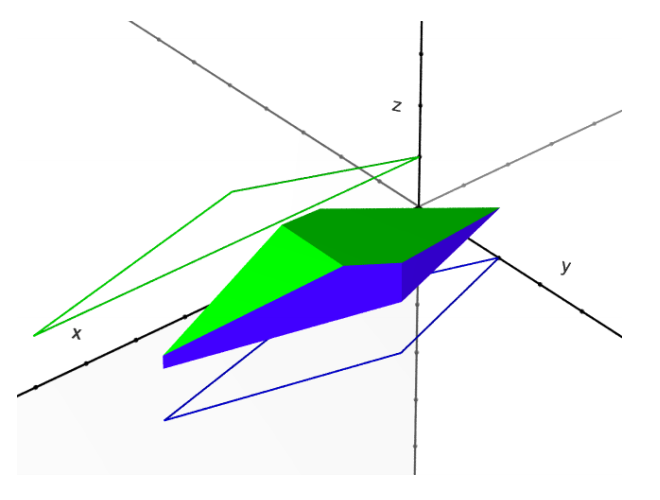

## 문제

Suppose that P1 is an infinite-height prism whose axis is parallel to the z-axis, and P2 is also an infinite-height prism whose axis is parallel to the y-axis. P1 is defined by the polygon C1 which is the cross section of P1 and the xy-plane, and P2 is also defined by the polygon C2 which is the cross section of P2 and the xz-plane.

Figure I.1 shows two cross sections which appear as the first dataset in the sample input, and Figure I.2 shows the relationship between the prisms and their cross sections.



C1 : Cross section of P1 and the xy-plane(Left) C2 : Cross section of P2 and the xz-plane(Right)

Figure I.1: Cross sections of Prisms



P1 and C1(Left) P2 and C2(Right)

Figure I.2: Prisms and their cross sections



Figure I.3: Intersection of two prisms

Figure I.3 shows the intersection of two prisms in Figure I.2, namely, P1 and P2.

Write a program which calculates the volume of the intersection of two prisms.

## 입력

The input is a sequence of datasets. The number of datasets is less than 200.

Each dataset is formatted as follows.

```

m n
x11 y11
x12 y12
.
.
.
x1m y1m
x21 z21
x22 z22
.
.
.
x2n z2n
```

m and n are integers (3 ≤ m ≤ 100, 3 ≤ n ≤ 100) which represent the numbers of the vertices of the polygons, C1 and C2, respectively.

x1i, y1i, x2j and z2j are integers between −100 and 100, inclusive. (x1i, y1i) and (x2j, z2j) mean the i-th and j-th vertices’ positions of C1 and C2 respectively.

The sequences of these vertex positions are given in the counterclockwise order either on the xy-plane or the xz-plane as in Figure I.1.

You may assume that all the polygons are convex, that is, all the interior angles of the polygons are less than 180 degrees. You may also assume that all the polygons are simple, that is, each polygon’s boundary does not cross nor touch itself.

The end of the input is indicated by a line containing two zeros.

## 출력

For each dataset, output the volume of the intersection of the two prisms, P1 and P2, with a decimal representation in a line.

None of the output values may have an error greater than 0.001. The output should not contain any other extra characters.
