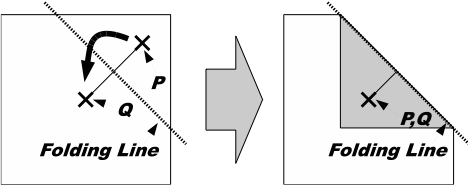
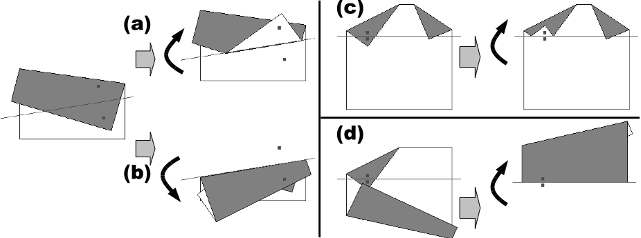
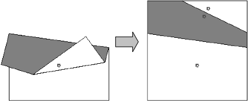

## 문제

Origami is the traditional Japanese art of paper folding. One day, Professor Egami found the message board decorated with some pieces of origami works pinned on it, and became interested in the pinholes on the origami paper. Your mission is to simulate paper folding and pin punching on the folded sheet, and calculate the number of pinholes on the original sheet when unfolded.

A sequence of folding instructions for a flat and square piece of paper and a single pinhole position are specified. As a folding instruction, two points P and Q are given. The paper should be folded so that P touches Q from above (Figure 4). To make a fold, we first divide the sheet into two segments by creasing the sheet along the folding line, i.e., the perpendicular bisector of the line segment P Q, and then turn over the segment containing P onto the other. You can ignore the thickness of the paper.



Figure 4: Simple case of paper folding

The original flat square piece of paper is folded into a structure consisting of layered paper segments, which are connected by linear hinges. For each instruction, we fold one or more paper segments along the specified folding line, dividing the original segments into new smaller ones. The folding operation turns over some of the paper segments (not only the new smaller segments but also some other segments that have no intersection with the folding line) to the reflective position against the folding line. That is, for a paper segment that intersects with the folding line, one of the two new segments made by dividing the original is turned over; for a paper segment that does not intersect with the folding line, the whole segment is simply turned over.

The folding operation is carried out repeatedly applying the following rules, until we have no segment to turn over.

* Rule 1: The uppermost segment that contains P must be turned over.
* Rule 2: If a hinge of a segment is moved to the other side of the folding line by the operation, any segment that shares the same hinge must be turned over.
* Rule 3: If two paper segments overlap and the lower segment is turned over, the upper segment must be turned over too.

In the examples shown in Figure 5, (a) and (c) show cases where only Rule 1 is applied. (b) shows a case where Rule 1 and 2 are applied to turn over two paper segments connected by a hinge, and (d) shows a case where Rule 1, 3 and 2 are applied to turn over three paper segments.



Figure 5: Different cases of folding

After processing all the folding instructions, the pinhole goes through all the layered segments of paper at that position. In the case of Figure 6, there are three pinholes on the unfolded sheet of paper.



Figure 6: Number of pinholes on the unfolded sheet

## 입력

The input is a sequence of datasets. The end of the input is indicated by a line containing a zero.

Each dataset is formatted as follows.

```

k
px1 py1 qx1 qy1
pxk pyk qxk qyk
.
.
.
hx hy
```

For all datasets, the size of the initial sheet is 100 mm square, and, using mm as the coordinate unit, the corners of the sheet are located at the coordinates (0, 0), (100, 0), (100, 100) and (0, 100). The integer k is the number of folding instructions and 1 ≤ k ≤ 10. Each of the following k lines represents a single folding instruction and consists of four integers pix , piy , qix and qiy , delimited by a space. The positions of point P and Q for the i-th instruction are given by (pix , piy ) and (qix , qiy ), respectively. You can assume that P ≠ Q. You must carry out these instructions in the given order. The last line of a dataset contains two integers hx and hy delimited by a space, and (hx, hy) represents the position of the pinhole.

You can assume the following properties:

* The points P and Q of the folding instructions are placed on some paper segments at the folding time, and P is at least 0.01 mm distant from any borders of the paper segments.
* The position of the pinhole also is at least 0.01 mm distant from any borders of the paper segments at the punching time.
* Every folding line, when infinitely extended to both directions, is at least 0.01 mm distant from any corners of the paper segments before the folding along that folding line.
* When two paper segments have any overlap, the overlapping area cannot be placed between any two parallel lines with 0.01 mm distance. When two paper segments do not overlap, any points on one segment are at least 0.01 mm distant from any points on the other segment.

For example, Figure 5 (a), (b), (c) and (d) correspond to the first four datasets of the sample input.

## 출력

For each dataset, output a single line containing the number of the pinholes on the sheet of paper, when unfolded. No extra characters should appear in the output.
