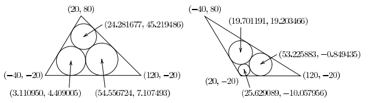

## 문제

삼각형 안에 세 개의 원을 각각의 원이 다른 두 원과 삼각형의 두 변에 접하게 그릴 수 있다. 이러한 원을 말파티 원(Malfatti Circles)이라고 한다. 많은 수학자들이 말파티 원을 두 세기 이상 연구하였다. 임의의 삼각형에 대해서 말파티 원은 항상 존재하고 유일하다는 것이 증명되어 있다.

삼각형의 꼭짓점이 (20, 80), (-40, -20), (120,-20)일 때, 삼각형의 말파티 원은 다음과 같다.

* 원의 중심이 (24.281677, 45.219486), 반지름이 21.565935
* 원의 중심이 (3.110950, 4.409005), 반지름이 24.409005
* 원의 중심이 (54.556724, 7.107493), 반지름이 27.107493

또, 삼각형의 꼭짓점이 (20, -20), (120, -20), (-40, 80)일 때, 삼각형의 말파티 원은 다음과 같다.

* 원의 중심이 (25.629089, -10.057956), 반지름이 9.942044
* 원의 중심이 (53.225883, -0.849435), 반지름이 19.150565
* 원의 중심이 19.701191, 19.203466), 반지름이 19.913790

삼각형이 주어졌을 때, 말파티 원을 구하는 프로그램을 작성하시오.

## 입력

입력은 여러 개의 테스트 케이스로 이루어져 있다. 각 테스트 케이스는 여섯 정수 x1, y1, x2, y2, x3, y3이 공백으로 구분되어져 있다. 이 좌표는 삼각형의 각 꼭짓점이고 (x1, y1), (x2, y2), (x3, y3)이다. 입력으로 주어지는 삼각형의 꼭짓점은 반시계방향 순서이고 다음과 같은 조건을 만족한다.

1. 모든 꼭짓점의 좌표는 -1000보다 크고 1000보다 작다.
2. 반지름이 0.1보다 작은 말파티 원은 없다.

입력의 마지막 줄에는 0이 여섯 개 주어진다.

## 출력

각 테스트 케이스에 대해서 말파티 원의 반지름 r1, r2, r3를 소수점 여섯째 자리까지 출력한다. ri는 꼭짓점 (xi, yi)와 가장 가까운 원의 반지름이다.

출력하는 반지름의 오차는 0.0001보다 크면 안 된다.
