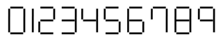
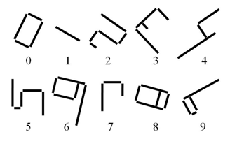
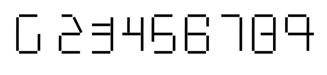
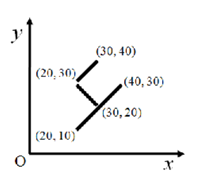

## 문제

Taro attempts to tell digits to Hanako by putting straight bars on the floor. Taro wants to express each digit by making one of the forms shown in Figure 2.

Since Taro may not have bars of desired lengths, Taro cannot always make forms exactly as shown in Figure 2. Fortunately, Hanako can recognize a form as a digit if the connection relation between bars in the form is kept. Neither the lengths of bars nor the directions of forms affect Hanako’s perception as long as the connection relation remains the same. For example, Hanako can recognize all the awkward forms in Figure 3 as digits. On the other hand, Hanako cannot recognize the forms in Figure 4 as digits. For clarity, touching bars are slightly separated in Figures 2, 3 and 4. Actually, touching bars overlap exactly at one single point.



Figure 2: Representation of digits



Figure 3: Examples of forms recognized as digits

In the forms, when a bar touches another, the touching point is an end of at least one of them. That is, bars never cross. In addition, the angle of such two bars is always a right angle.

To enable Taro to represent forms with his limited set of bars, positions and lengths of bars can be changed as far as the connection relations are kept. Also, forms can be rotated.

Keeping the connection relations means the following.



Figure 4: Forms not recognized as digits (these kinds of forms are not contained in the dataset)

* Separated bars are not made to touch.
* Touching bars are not made separate.
* When one end of a bar touches another bar, that end still touches the same bar. When it touches a midpoint of the other bar, it remains to touch a midpoint of the same bar on the same side.
* The angle of touching two bars is kept to be the same right angle (90 degrees and −90 degrees are considered different, and forms for 2 and 5 are kept distinguished).

Your task is to find how many times each digit appears on the floor.

The forms of some digits always contain the forms of other digits. For example, a form for 9 always contains four forms for 1, one form for 4, and two overlapping forms for 7. In this problem, ignore the forms contained in another form and count only the digit of the “largest” form composed of all mutually connecting bars. If there is one form for 9, it should be interpreted as one appearance of 9 and no appearance of 1, 4, or 7.

## 입력

The input consists of a number of datasets. Each dataset is formatted as follows.

```

n
x1a y1a x1b y1b
x2a y2a x2b y2b
.
.
.
xna yna xnb xnb
```

In the first line, n represents the number of bars in the dataset. For the rest of the lines, one line represents one bar. Four integers xa, ya, xb, yb, delimited by single spaces, are given in each line. xa and ya are the x- and y-coordinates of one end of the bar, respectively. xb and yb are those of the other end. The coordinate system is as shown in Figure 5. You can assume 1 ≤ n ≤ 1000 and 0 ≤ xa, ya, xb, yb ≤ 1000.

The end of the input is indicated by a line containing one zero.



Figure 5: The coordinate system

You can also assume the following conditions.

* More than two bars do not overlap at one point.
* Every bar is used as a part of a digit. Non-digit forms do not exist on the floor.
* A bar that makes up one digit does not touch nor cross any bar that makes up another digit.
* There is no bar whose length is zero.

## 출력

For each dataset, output a single line containing ten integers delimited by single spaces. These integers represent how many times 0, 1, 2, . . . , and 9 appear on the floor in this order. Output lines must not contain other characters.
