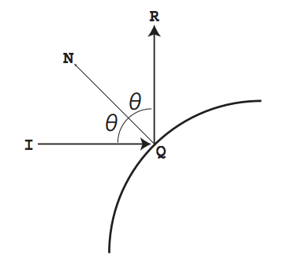

## 문제

3차원 공간 위에 N개의 구면거울이 있다.

이때, (0,0,0)에서 (u,v,w)방향으로 레이저를 발사하려고 한다. 레이저는 항상 직선으로 움직인다.

I에서 발사한 레이저가 구면 거울의 Q에서 반사되었을 때, 점 N을 구면 거울의 바깥에 있으면서, 구면 거울의 중심과 Q를 잇는 일직선위의 한 점이라고 하자. 이때, 레이저는 다음과 같은 조건을 만족하는 R방향으로 반사딘다.

(1) R은 I, Q, N으로 만든 평면 위의 한 점이다. ∠IQN = ∠NQR

레이저가 마지막으로 반사되는 점의 위치를 찾는 프로그램을 작성하시오.

## 입력

첫째 줄에 테스트 케이스의 개수 T가 주어진다. 각 테스트 케이스의 첫째 줄에는 구면 거울의 개수 N이 주어진다. 둘째 줄에는 레이저를 발사한 방향 u, v, w가 공백으로 구분되어 주어진다.

다음 N개의 줄에는 구면 거울을 설명하는 4개의 정수 xi,yi,zi,ri가 주어진다. 구면 거울의 중심은 (xi,yi,zi)이고, 반지름은 ri이다.

1 ≤ N ≤ 100

-100 ≤ u,v,w ≤ 100

-100 ≤ xi,yi,zi ≤ 100

5 ≤ ri ≤ 30

u2 + v2 + w2 > 0

두 구면 거울 사이의 거리는 적어도 0.1이다. (0,0,0)은 모든 구면 거울의 바깥점이고, 모든 구면 거울과 적어도 0.1만큼 떨어져 있다.

레이저는 구면 거울에 적어도 1번, 많아야 5번 반사된다. 또, 반사각(그림에서 θ)은 항상 85도보다 작다.

## 출력

각각의 테스트 케이스에 대해서, 마지막으로 반사되는 점의 좌표를 공백으로 구분하여 출력한다. 모든 좌표는 소수점 넷째 자리에서 반올림해서 셋째 자리까지 출력한다.
