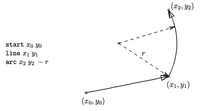
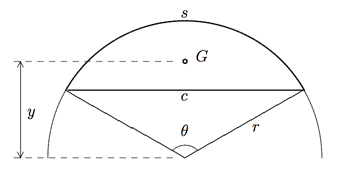
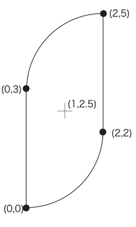

## 문제

Spinning tops are one of the most popular and the most traditional toys. Not only spinning them, but also making one’s own is a popular enjoyment.

One of the easiest way to make a top is to cut out a certain shape from a cardboard and pierce an axis stick through its center of mass. Professionally made tops usually have three dimensional shapes, but in this problem we consider only two dimensional ones.

Usually, tops have rotationally symmetric shapes, such as a circle, a rectangle (with 2-fold rotational symmetry) or a regular triangle (with 3-fold symmetry). Although such symmetries are useful in determining their centers of mass, they are not definitely required; an asymmetric top also spins quite well if its axis is properly pierced at the center of mass.

When a shape of a top is given as a path to cut it out from a cardboard of uniform thickness, your task is to find its center of mass to make it spin well. Also, you have to determine whether the center of mass is on the part of the cardboard cut out. If not, you cannot pierce the axis stick, of course.

Java Specific: Submitted Java programs may not use classes implementing the interface “java.awt.Shape”. You may use them for your debugging purposes.

## 입력

The input consists of multiple datasets, each of which describes a counterclockwise path on a cardboard to cut out a top. A path is indicated by a sequence of command lines, each of which specifies a line segment or an arc.

In the description of commands below, the current position is the position to start the next cut, if any. After executing the cut specified by a command, the current position is moved to the end position of the cut made.

The commands given are one of those listed below. The command name starts from the first column of a line and the command and its arguments are separated by a space. All the command arguments are integers.

* start x y
  + Specifies the start position of a path. This command itself does not specify any cutting; it only sets the current position to be (x, y).
* line x y
  + Specifies a linear cut along a straight line from the current position to the position (x, y), which is not identical to the current position.
* arc x y r
  + Specifies a round cut along a circular arc. The arc starts from the current position and ends at (x, y), which is not identical to the current position. The arc has a radius of |r|. When r is negative, the center of the circle is to the left side of the direction of this round cut; when it is positive, it is to the right side (Figure 7). The absolute value of r is greater than the half distance of the two ends of the arc. Among two arcs connecting the start and the end positions with the specified radius, the arc specified is one with its central angle less than 180 degrees.
* close
  + Closes a path by making a linear cut to the initial start position and terminates a dataset. If the current position is already at the start position, this command simply indicates the end of a dataset.

The figure below gives an example of a command sequence and its corresponding path. Note that, in this case, the given radius −r is negative and thus the center of the arc is to the left of the arc. The arc command should be interpreted as shown in this figure and, not the other way around on the same circle.

Figure 7: A partial command sequence and the path specified so far

A dataset starts with a start command and ends with a close command.

The end of the input is specified by a line with a command end.

There are at most 100 commands in a dataset and at most 100 datasets are in the input. Absolute values of all the coordinates and radii are less than or equal to 100.

You may assume that the path does not cross nor touch itself. You may also assume that paths will never expand beyond edges of the cardboard, or, in other words, the cardboard is virtually infinitely large.

## 출력

For each of the dataset, output a line containing x- and y-coordinates of the center of mass of the top cut out by the path specified, and then a character ‘+’ or ‘-’ indicating whether this center is on the top or not, respectively. Two coordinates should be in decimal fractions. There should be a space between two coordinates and between the y-coordinate and the character ‘+’ or ‘-’. No other characters should be output. The coordinates may have errors less than 10−3.You may assume that the center of mass is at least 10−3 distant from the path.

## 힌트

An important nature of mass centers is that, when an object \(O\) can be decomposed into parts \(O\_1\), ... , \(O\_n\) with masses \(M\_1\), ... , \(M\_n\), the center of mass of \(O\) can be computed by:

\[G = \frac{\sum\_{i=1}^{n}{M\_i \times G\_i}}{\sum\_{i=1}^{n}{M\_i}}\]

where \(G\_k\) is the vector pointing the center of mass of \(O\_k\).

A circular segment with its radius \(r\) and angle \(\theta\) (in radian) has its arc length \(s = r\theta\) and its chord length \(c = r\sqrt{2-2\cos{\theta}}\). Its area size is \(A = r^2(\theta-\sin{\theta})/2\) and its center of mass \(G\) is \(y=2r^3\sin^{3}{(\theta/2)/(3A)}\) distant from the circle center.

Figure 8: Circular segment and its center of mass

Figure 9: The first sample top.
