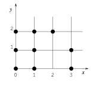
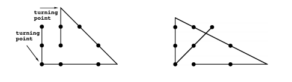
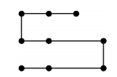
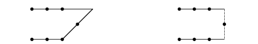
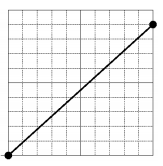
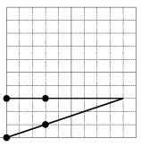
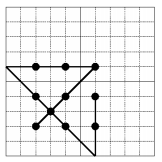
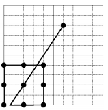

## 문제

평면 위에 점이 여러 개 주어진다. 이 점을 모두 지나는 지그재그 선을 찾으려고 한다. 이때, 전환점(turning point)의 개수를 가장 적게 하려고 한다. 또, 전환점의 개수가 같은 경우에는 선의 길이가 가장 작은 것을 찾으려고 한다.

예를 들어, 아래와 같이 평면 위에 점이 9개가 있다고 하자.

지그재그 선은 여러 선분으로 이루어져 있고, 각 선분은 점을 두 개 이상 지나야 한다.

지그재그 선은 선이 꺽일 수 있는데, 이 꺽이는 지점을 전환점(turning point)라고 한다. 전환점은 주어진 점 위에 있을 수도 있고, 아닐 수도 있다.

왼쪽 지그재그 선의 길이: 8 + 3√2 ≃ 12.242641, 오른쪽 지그재그 선의 길이: 2√2 + (6 + 1/2) + 5√5/2 ≃ 14.918597

위의 그림은 주어진 점을 지나는 지그재그 선이고 두 선 모두 전환점의 개수는 3개이다. 왼쪽 지그재그 선의 길이는 오른쪽 지그재그 선의 길이보다 짧다. 또, 왼쪽 지그재그 선은 주어진 아홉 개의 점을 지나는 가장 짧은 지그재그 선이다.

전환점을 네 개 갖는 지그재그 선은 아래와 같다. 이 선의 길이는 위의 그림의 길이보다 짧지만, 전환점의 수가 더 많기 때문에 정답이 아니다.

아래와 같이 점이 7개 있고, 그 점을 잇는 두가지로 이었다고 하자. 이때, 왼쪽의 길이가 오른쪽보다 더 길지만, 정답은 왼쪽 그림이 된다. 그 이유는 지그재그 선의 모든 선분은 점을 두 개 이상 지나야 하기 때문이다.

점이 주어졌을 때, 지그재그 선을 구하는 프로그램을 작성하시오.

## 입력

입력은 여러 개의 테스트 케이스로 이루어져 있다. 각 테스트 케이스의 첫째 줄에는 점의 개수 n이 주어진다. 다음 n개의 줄에는 점의 좌표가 주어진다.

모든 좌표는 음이 아닌 정수이고, 공백으로 구분되어 있다. n은 2이상 10이하의 자연수이고, x,y좌표는 0이상 10이하의 정수이다. 점의 순서는 별 의미가 없다.

## 출력

각 테스트 케이스에 대해서, 가장 적은 전환점을 갖는 지그재그 선 중 가장 짧은 것의 전환점의 개수와 길이를 출력한다. 선의 길이는 정답과의 오차가 0.0001까지 허용된다.

가장 적은 전환점의 개수는 최대 4개이며, 따라서 선분의 개수는 최대 5개가 된다.

## 힌트

첫 번째 데이터: 

두 번째 데이터: 

세 번째 데이터: 

네 번째 데이터: 
