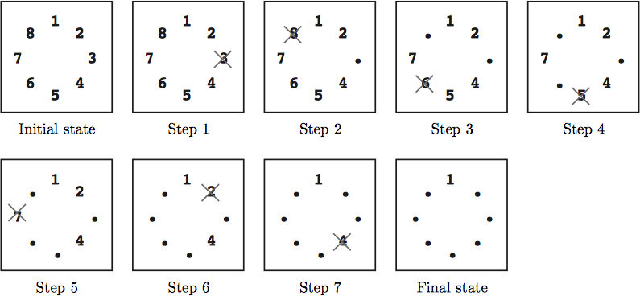

## 문제

돌 치우기 게임을 해보자.

처음에는 그림 1과 같이 1~n까지의 번호가 매겨진 n개의 돌이 시계방향으로 늘어서 있다. 그리고 두 개의 숫자 k와 m이 주어진다. 이 상태에서, 돌이 하나만 남을 때 까지 아래의 규칙대로 돌을 하나씩 치운다.

* 스텝1: 돌 m을 치운다.
* 스텝i: 스텝 (i-1)에서 치운 돌의 위치에서 시작하여 남은 돌 중 시계 방향으로 k번째에 위치한 돌을 치운다. 즉, k-1개의 돌을 건너뛴 후 있는 돌을 치우며, 이미 치운 돌은 건너뛰는 회수로 세지 않는다. (i ≥ 2)

스텝1, 스텝2, 스텝3, ... 을 순차적으로 실행하여 돌이 하나만 남을 때까지 반복할 때 남은 돌이 게임의 답이 된다.

예를 들어, 그림1에서와 같이 n = 8, k = 5, m = 3 인 경우 답은 1이다.

그림1: 게임 예제

* 초기 상태: 8개의 돌이 시계방향으로 있다.
* 스텝1: m=3이므로 돌 3이 제거된다.
* 스텝2: 3에서 시작해서 k=5이므로 돌 4, 5, 6, 7 (총 4개)를 스킵하고 8을 제거한다.
* 스텝3: 8에서 시작해서 돌 1, 2, 4, 5를 스킵하고 6을 제거한다. 돌 3은 무시되었음 (즉, 스킵 회수에 포함되지 않았음) 을 주목할 것.
* 스텝4-7: 하나의 돌만 남을 때까지 계속한다.
* 마지막 스텝: 남은 돌이 1이므로 답은 1이다.

## 입력

입력은 여러개의 데이터 행이며, 각 데이터는 다음과 같은 3개의 숫자로 이루어진다.

n k m

마지막 데이터 행 다음은 3개의 0으로 이루어진 행이다. 각 수는 다음 범위를 만족한다.

2 ≤ n ≤ 10000, 1 ≤ k ≤ 10000, 1 ≤ m ≤ n

데이터 행의 수는 100보다 작다.

## 출력

각 데이터 행에 대해서 마지막 남은 돌의 번호를 각각 출력한다.
