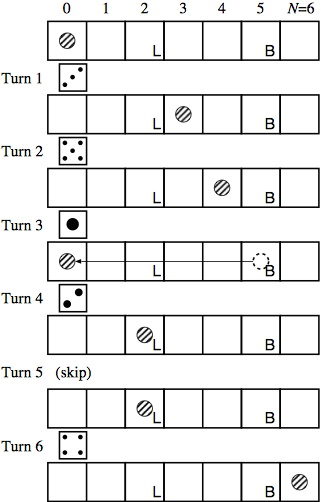

## 문제

Here is a very simple variation of the game backgammon, named “Minimal Backgammon”. The game is played by only one player, using only one of the dice and only one checker (the token used by the player).

The game board is a line of (N + 1) squares labeled as 0 (the start) to N (the goal). At the beginning, the checker is placed on the start (square 0). The aim of the game is to bring the checker to the goal (square N). The checker proceeds as many squares as the roll of the dice. The dice generates six integers from 1 to 6 with equal probability.

The checker should not go beyond the goal. If the roll of the dice would bring the checker be- yond the goal, the checker retreats from the goal as many squares as the excess. For example, if the checker is placed at the square (N − 3), the roll “5” brings the checker to the square (N −2), because the excess beyond the goal is 2. At the next turn, the checker proceeds toward the goal as usual.

Each square, except the start and the goal, may be given one of the following two special instruc- tions.

* Lose one turn (labeled “L” in Figure 2) If the checker stops here, you cannot move the checker in the next turn.
* Go back to the start (labeled “B” in Fig- ure 2) If the checker stops here, the checker is brought back to the start.

Given a game board configuration (the size N, and the placement of the special instructions), you are requested to compute the probability with which the game succeeds within a given number of turns.



Figure 1: An example game

## 입력

The input consists of multiple datasets, each containing integers in the following format.

```

N T L B
Lose1
···
LoseL
Back1
···
BackB
```

N is the index of the goal, which satisfies 5 ≤ N ≤ 100. T is the number of turns. You are requested to compute the probability of success within T turns. T satisfies 1 ≤ T ≤ 100. L is the number of squares marked "Lose one turn", which satisfies 0 ≤ L ≤ N − 1. B is the number of squares marked "Go back to the start", which satisfies 0 ≤ B ≤ N − 1. They are separated by a space.

Losei's are the indexes of the squares marked "Lose one turn", which satisfy 1 ≤ Losei ≤ N − 1. All Losei's are distinct, and sorted in ascending order. Backi's are the indexes of the squares marked "Go back to the start", which satisfy 1 ≤ Backi ≤ N − 1. All Backi's are distinct, and sorted in ascending order. No numbers occur both in Losei's and Backi's.

The end of the input is indicated by a line containing four zeros separated by a space.

## 출력

For each dataset, you should answer the probability with which the game succeeds within the given number of turns. The output should not contain an error greater than 0.00001.
