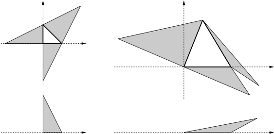

## 문제

You are constructing a triangular pyramid with a sheet of craft paper with grid lines. Its base and sides are all of triangular shape. You draw the base triangle and the three sides connected to the base on the paper, cut along the outer six edges, fold the edges of the base, and assemble them up as a pyramid.

You are given the coordinates of the base’s three vertices, and are to determine the coordinates of the other three. All the vertices must have integral X- and Y-coordinate values between −100 and +100 inclusive. Your goal is to minimize the height of the pyramid satisfying these conditions. Figure 3 shows some examples.



Figure 3: Some craft paper drawings and side views of the assembled pyramids

## 입력

The input consists of multiple datasets, each in the following format.

```

X0 Y0 X1 Y1 X2 Y2
```

They are all integral numbers between −100 and +100 inclusive. (X0,Y0), (X1,Y1), (X2,Y2) are the coordinates of three vertices of the triangular base in counterclockwise order.

The end of the input is indicated by a line containing six zeros separated by a single space.

## 출력

For each dataset, answer a single number in a separate line. If you can choose three vertices (Xa,Ya), (Xb,Yb) and (Xc,Yc) whose coordinates are all integral values between −100 and +100 inclusive, and triangles (X0,Y0)–(X1,Y1)–(Xa,Ya), (X1,Y1)–(X2,Y2)–(Xb,Yb), (X2,Y2)– (X0,Y0)–(Xc,Yc) and (X0,Y0)–(X1,Y1)–(X2,Y2) do not overlap each other (in the XY-plane), and can be assembled as a triangular pyramid of positive (non-zero) height, output the minimum height among such pyramids. Otherwise, output −1.

You may assume that the height is, if positive (non-zero), not less than 0.00001. The output should not contain an error greater than 0.00001.
