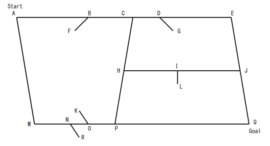

## 문제

어떤 도시의 도로 지도가 주어졌을 때, 주어진 두 점 사이의 최단거리를 찾는 프로그램을 작성하시오.

도로 지도는 평면 위의 선분의 집합으로 표현한다.

위의 그림은 도로 지도의 예이다. 어떤 선분은 도로를 나타내고, 나머지 선분은 어떤 방향으로 움직일 수 없는지를 나타내는 표지판이다. 위의 그림에서는 AE, AM, MQ, EQ, CP, HJ는 도로를 나타내고, 나머지는 표지판을 나타낸다. 어떤 선분의 양 끝점 중, 한 끝점은 선분과 만나고, 다른 끝점은 그렇지 않다면, 그 선분은 표지판을 나타내는 선분이다.

그림에서 표지판 BF는 점 B에서 차는 왼쪽에서 오른쪽으로 움직일 수 있지만, 반대방향으로는 움직일 수 없다는 뜻이다. 표지판과 도로가 이루는 각 중, 둔각이 있는 방향에서 예각쪽으로는 이동할 수 없다. (각 CBF는 둔각이고, ABF는 예각이다) 따라서, 위의 지도에서 P에서 M으로 가거나, M에서 P로는 갈 수가 없다. 만약, 표지판과 도로가 직각을 이루는 경우에는 그 표지판을 지날 수 없다는 뜻이다. 위의 그림에서는 IL때문에, H에서 J로, J에서 H로 갈 수가 없다.

두 점이 주어졌을 때, 위의 규칙을 지키면서 가장 짧은 경로를 찾는 프로그램을 작성하시오. 두 점 (x1, y1), (x2, y2)사이의 거리는 루트((x2-x1)2+(y2-y1)2)와 같다.

## 입력

첫째 줄에 테스트 케이스의 개수 T가 주어진다. 각 테스트 케이스는 다음과 같이 구성되어 있다.

테스트 케이스의 첫째 줄에는 선분의 개수 n이 주어진다. n은 200보다 작거나 같은 자연수이다. 둘째 줄에는 xs와 ys가, 셋째 줄에는 xg와 yg가 우어진다. (xs,sy)는 시작점, (xg,yg)는 끝점이고, 두 점 사이의 최단 거리를 계산하면 된다. (xs,ys)는 (xg,yg)는 같지 않으며, 최단 경로는 항상 유일하다.

다음 줄부터 n개의 줄에는 선분의 정보가 주어진다. 선분의 정보는 x1k y1k x2k y2k와 같은 형식으로 주어지며, k번째 선분의 양 끝점이다. (x1k,y1k)와 (x2k,y2k)는 같지 않고, 두 선분이 교차하는 경우는 없다. 즉, 선분은 항상 끝점을 공유한다.

모든 좌표는 1000보다 작거나 같은 음이 아닌 정수이다.

## 출력

각각의 테스트 케이스에 대해서, 입력으로 주어진 시작점과 끝점사이의 최단 경로 중 교차점을 모두 출력한다. 각 테스트 케이스의 마지막 줄에는 0을 출력한다.

교차점은 적어도 두 선분이 만나는 점을 말하며, x좌표와 y좌표를 공백으로 구분해서 출력한다. 만약 시작점에서 끝점으로 가는 경로가 없을 때는 -1을 출력한다.
