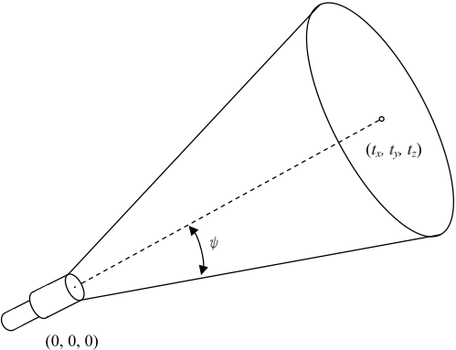

## 문제

One of the questions children often ask is "How many stars are there in the sky?" Under ideal conditions, even with the naked eye, nearly eight thousands are observable in the northern hemisphere. With a decent telescope, you may find many more, but, as the sight field will be limited, you may find much less at a time.

Children may ask the same questions to there parents on a planet of some solar system billlions of light-years away from the Earth. Their telescopes are similar to ours with circular sight fields, but alien kids have many eyes and can look into different directions at a time through many telescopes.

Given an set of positions of stars, a set of telescopes and the directions they are looking to, your task is to count up how many stars can be seen through these telescopes.

## 입력

The input consists of one or more datasets. The number of datasets is less than 50. Each dataset describs stars and the parameters of the telescopes used.

The first line of a dataset contains a positive integer n not exceeding 500, meaning the number of stars. Each of the n lines following it contains three decimal fractions, sx, sy, and sz. They give the position (sx, sy, sz) of the star described in Euclidean coordinates. You many assume -1000 ≤ sx ≤ 1000, -1000 ≤ sy ≤ 1000, -1000 ≤ sz ≤ 1000 and (sx, sy, sz) ≠ (0, 0, 0)

Then comes a line containing a positive integer m not exceeding 50, meaning the number of telescopes. Each of the following m lines contains four decimal fractions, tx, ty, tz, and ψ, describing a telescope.

The first three numbers represent the direction of the telescope. All the telescopes are at the origin of the coordinate system (0, 0, 0) (we ignore the size of the planet). The three numbers give the point (tx, ty, tz) which can be seen in the center of the sight through the telescope. You may assume -1000 ≤ tx ≤ 1000, -1000 ≤ ty ≤ 1000, -1000 ≤ tz ≤ 1000 and (tx, ty, tz) ≠ (0, 0, 0).

The fourth number ψ (0 ≤ ψ ≤ π/2) gives the angular radius, in radians, of the sight filed of the telescope.

Let us define that θi,j is the angle between the direction of the i-th star and the center direction of the j-th telescope and ψj is the angular radius of the sight filed of the j-th telescope. The i-th star is observable through the j-th telescope if and only if θi,j is less than ψj. You may assume that |θi,j - ψj| > 0.00000001 for all pairs of i and j.

Figure 1: Direction and angular radius of a telescope

The end of the input is indicated with a line containing a single zero.

## 출력

For each dataset, one line containing an integer meaning the number of stars observable through the telescopes should be output. No other characters should be contained in the output. Note that stars that can be seen through more than one telescope should not be counted twice or more.
