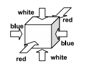
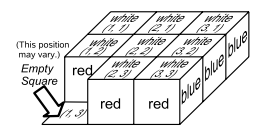
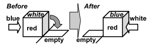

## 문제

8개 주사위가 3\*3 보드에 놓여져 있는 게임이 있다. (한 칸은 비어져 있다)

주사위의 각 면은 세가지 색상으로 색칠되어 있다. 만약 주사위의 인접한 칸이 비어있다면, 주사위를 그 칸으로 굴릴 수 있다.

이 퍼즐의 규칙은 다음과 같다.

1. 모든 주사위의 색상은 다음과 같이 색칠되어져 있다. 마주보는 면은 같은 색상이다.

2. 3\*3 보드 중 한 칸은 비어져있으며, 나머지 칸은 주사위가 채워져 있다. 보드의 초기 상태는 아래 그림과 같다. 보드의 각 칸은 x, y좌표로 표시할 수 있고, 비어있는 칸은 다를 수도 있다.

3. 주사위는 인접한 칸 중 비어있는 칸으로 굴릴 수 있다. 이렇게 굴리게 된다면, 원래 주사위가 있던 칸은 비어있게 된다.

4. 퍼즐을 푸는 경우는 주사위의 윗 면이 문제에 주어진 색상대로 되는 것이다.

제일 처음에 퍼즐의 비어있는 칸과, 퍼즐의 목표 색상이 주어졌을 때, 퍼즐을 푸는데 필요한 굴림의 최소 회수를 출력하는 프로그램을 작성하시오.

## 입력

입력은 테스트 케이스가 여러 개 주어진다. 각 테스트 케이스의 첫째 줄에는 퍼즐 초기 상태의 빈 칸의 좌표가 주어진다. 다음 3개 줄에는 퍼즐의 목표 색상이 주어진다. 이 색상은 B, W, R, E 중 하나이고, B는 Blue, W는 White, R은 Red, E는 빈 칸이다. E는 반드시 1개만 주어진다.

테스트 케이스의 끝은 빈 칸의 좌표가 0 0인 경우이다.

테스트 케이스는 16개보다 작다.

## 출력

각 테스트 케이스에 대해서 퍼즐을 푸는데 필요한 굴림의 최솟값을 출력한다. 만약, 이 값이 30을 넘거나 퍼즐을 풀 수 없다면 -1을 출력한다.
