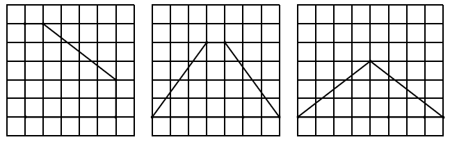

## 문제

The ultimate Tantra is said to have been kept in the most distinguished temple deep in the sacred forest somewhere in Japan. Paleographers finally identified its location, surprisingly a small temple in Hiyoshi, after years of eager research. The temple has an underground secret room built with huge stones. This underground megalith is suspected to be where the Tantra is enshrined.

The room door is, however, securely locked. Legends tell that the key of the door lock was an integer, that only highest priests knew. As the sect that built the temple decayed down, it is impossible to know the integer now, and the Agency for Cultural Affairs bans breaking up the door. Fortunately, a figure of a number of rods that might be used as a clue to guess that secret number is engraved on the door.

Many distinguished scholars have challenged the riddle, but no one could have ever succeeded in solving it, until recently a brilliant young computer scientist finally deciphered the puzzle. Lengths of the rods are multiples of a certain unit length. He found that, to find the secret number, all the rods should be placed on a grid of the unit length to make one convex polygon. Both ends of each rod must be set on grid points. Elementary mathematics tells that the polygon's area ought to be an integer multiple of the square of the unit length. The area size of the polygon with the largest area is the secret number which is needed to unlock the door.

For example, if you have five rods whose lengths are 1, 2, 5, 5, and 5, respectively, you can make essentially only three kinds of polygons, shown in Figure 7. Then, you know that the maximum area is 19.



Figure 7: Convex polygons consisting of five rods of lengths 1, 2, 5, 5, and 5 16

Your task is to write a program to find the maximum area of convex polygons using all the given rods whose ends are on grid points.

## 입력

The input consists of multiple datasets, followed by a line containing a single zero which indicates the end of the input. The format of a dataset is as follows.

```

n 
r1 r2 ... rn
```

n is an integer which means the number of rods and satisfies 3≤n≤6. ri is an integer which means the length of the i-th rod and satisfies 1≤ri≤300.

## 출력

For each dataset, output a line containing an integer which is the area of the largest convex polygon. When there are no possible convex polygons for a dataset, output "-1".
