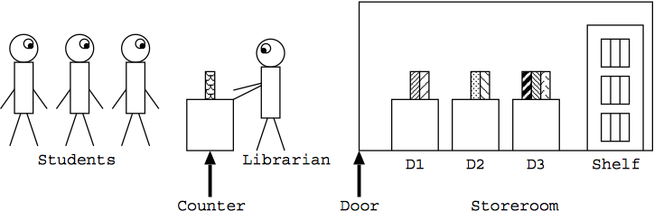

## 문제

The deadline of Prof. Hachioji's assignment is tomorrow. To complete the task, students have to copy pages of many reference books in the library.

All the reference books are in a storeroom and only the librarian is allowed to enter it. To obtain a copy of a reference book’s page, a student should ask the librarian to make it. The librarian brings books out of the storeroom and makes page copies according to the requests. The overall situation is shown in Figure 1.

Students queue up in front of the counter. Only a single book can be requested at a time. If a student has more requests, the student goes to the end of the queue after the request has been served.

In the storeroom, there are m desks D1, · · · , Dm, and a shelf. They are placed in a line in this order, from the door to the back of the room. Up to c books can be put on each of the desks. If a student requests a book, the librarian enters the storeroom and looks for it on D1, . . . , Dm in this order, and then on the shelf. After finding the book, the librarian takes it and gives a copy of a page to the student.



Figure 1: The Library

Then the librarian returns to the storeroom with the requested book, to put it on D1 according to the following procedure.

* If D1 is not full (in other words, the number of books on D1 < c), the librarian puts the requested book there.
* If D1 is full, the librarian
  + temporarily puts the requested book on the non-full desk closest to the entrance or, in case all the desks are full, on the shelf,
  + finds the book on D1 that has not been requested for the longest time (i.e. the least recently used book) and takes it,
  + puts it on the non-full desk (except D1) closest to the entrance or, in case all the desks except D1 are full, on the shelf,
  + takes the requested book from the temporary place,
  + and finally puts it on D1.

Your task is to write a program which simulates the behaviors of the students and the librarian, and evaluates the total cost of the overall process. Costs are associated with accessing a desk or the shelf, that is, putting/taking a book on/from it in the description above. The cost of an access is i for desk Di and m+1 for the shelf. That is, an access to D1,· · ·,Dm, and the shelf costs 1, · · · , m, and m + 1, respectively. Costs of other actions are ignored.

Initially, no books are put on desks. No new students appear after opening the library.

## 입력

The input consists of multiple datasets. The end of the input is indicated by a line containing three zeros separated by a space. It is not a dataset.

The format of each dataset is as follows.

```

m c n
k1
b11 ... b1k1
...
kn
bn1 ... bnkn
```

Here, all data items are positive integers. m is the number of desks not exceeding 10. c is the number of books allowed to put on a desk, which does not exceed 30. n is the number of students not exceeding 100. ki is the number of books requested by the i-th student, which does not exceed 50. bij is the ID number of the book requested by the i-th student on the j-th turn. No two books have the same ID number. Note that a student may request the same book more than once. bij is less than 100.

Here we show you an example of cost calculation for the following dataset.

```

3 1 2
3
60 61 62
2
70 60
```

In this dataset, there are 3 desks (D1,D2,D3). At most 1 book can be put on each desk. The number of students is 2. The first student requests 3 books of which IDs are 60, 61, and 62, respectively, and the second student 2 books of which IDs are 70 and 60, respectively.

The calculation of the cost for this dataset is done as follows. First, for the first request of the first student, the librarian takes the book 60 from the shelf and puts it on D1 and the first student goes to the end of the queue, costing 5. Next, for the first request of the second student, the librarian takes the book 70 from the shelf, puts it on D2, moves the book 60 from D1 to D3, and finally moves the book 70 from D2 to D1, costing 13. Similarly, the cost for the books 61, 60, and 62, are calculated as 14, 12, 14, respectively. Therefore, the total cost is 58.

## 출력

For each dataset, output the total cost of processing all the requests, in a separate line.
