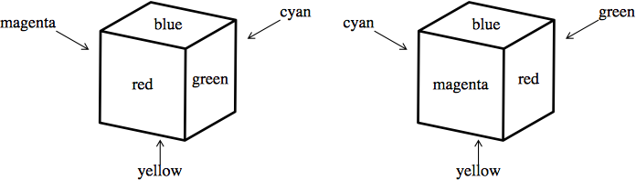
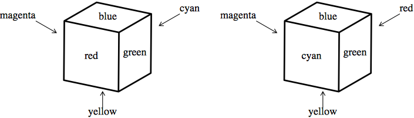
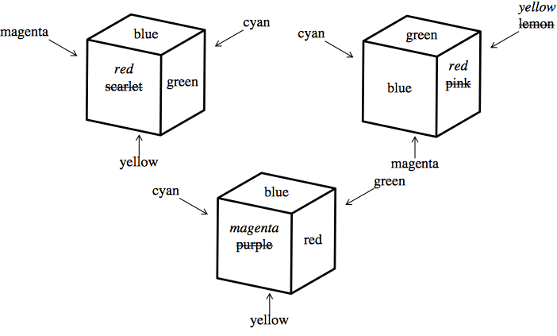
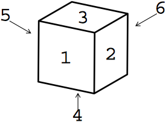
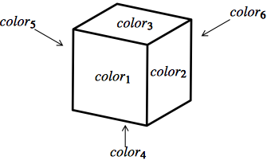

## 문제

There are several colored cubes. All of them are of the same size but they may be colored differently. Each face of these cubes has a single color. Colors of distinct faces of a cube may or may not be the same.

Two cubes are said to be identically colored if some suitable rotations of one of the cubes give identical looks to both of the cubes. For example, two cubes shown in Figure 2 are identically colored. A set of cubes is said to be identically colored if every pair of them are identically colored.

A cube and its mirror image are not necessarily identically colored. For example, two cubes shown in Figure 3 are not identically colored.

You can make a given set of cubes identically colored by repainting some of the faces, whatever colors the faces may have. In Figure 4, repainting four faces makes the three cubes identically colored and repainting fewer faces will never do.

Your task is to write a program to calculate the minimum number of faces that needs to be repainted for a given set of cubes to become identically colored.

## 입력

The input is a sequence of datasets. A dataset consists of a header and a body appearing in this order. A header is a line containing one positive integer n and the body following it consists of n lines. You can assume that 1 ≤ n ≤ 4. Each line in a body contains six color names separated by a space. A color name consists of a word or words connected with a hyphen (-). A word consists of one or more lowercase letters. You can assume that a color name is at most 24-characters long including hyphens.

A dataset corresponds to a set of colored cubes. The integer n corresponds to the number of cubes. Each line of the body corresponds to a cube and describes the colors of its faces. Color names in a line is ordered in accordance with the numbering of faces shown in Figure 5. A line

color 1 color 2 color 3 color 4 color 5 color 6 corresponds to a cube colored as shown in Figure 6.

The end of the input is indicated by a line containing a single zero. It is not a dataset nor a part of a dataset.

Figure 2: Identically colored cubes

Figure 3: cubes that are not identically colored

Figure 4: An example of recoloring

Figure 5: Numbering of faces

Figure 6: Coloring

## 출력

For each dataset, output a line containing the minimum number of faces that need to be repainted to make the set of cubes identically colored.
