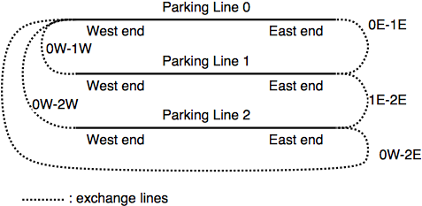
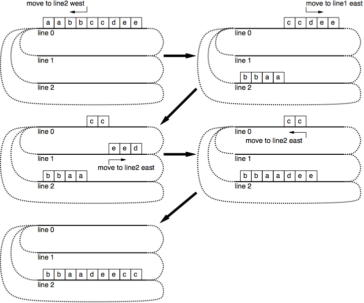

## 문제

In the good old Hachioji railroad station located in the west of Tokyo, there are several parking lines, and lots of freight trains come and go every day.

All freight trains travel at night, so these trains containing various types of cars are settled in your parking lines early in the morning. Then, during the daytime, you must reorganize cars in these trains according to the request of the railroad clients, so that every line contains the “right” train, i.e. the right number of cars of the right types, in the right order.

As shown in Figure 7, all parking lines run in the East-West direction. There are exchange lines connecting them through which you can move cars. An exchange line connects two ends of different parking lines. Note that an end of a parking line can be connected to many ends of other lines. Also note that an exchange line may connect the East-end of a parking line and the West-end of another.



Figure 7: Parking lines and exchange lines

Cars of the same type are not discriminated between each other. The cars are symmetric, so directions of cars don’t matter either.

You can divide a train at an arbitrary position to make two sub-trains and move one of them through an exchange line connected to the end of its side. Alternatively, you may move a whole train as is without dividing it. Anyway, when a (sub-) train arrives at the destination parking line and the line already has another train in it, they are coupled to form a longer train.

Your superautomatic train organization system can do these without any help of locomotive engines. Due to the limitation of the system, trains cannot stay on exchange lines; when you start moving a (sub-) train, it must arrive at the destination parking line before moving another train.

In what follows, a letter represents a car type and a train is expressed as a sequence of letters. For example in Figure 8, from an initial state having a train “aabbccdee” on line 0 and no trains on other lines, you can make “bbaadeecc” on line 2 with the four moves shown in the figure.



Figure 8: An example movement sequence

To cut the cost out, your boss wants to minimize the number of (sub-) train movements. For example, in the case of Figure 8, the number of movements is 4 and this is the minimum.

Given the configurations of the train cars in the morning (arrival state) and evening (departure state), your job is to write a program to find the optimal train reconfiguration plan.

## 입력

The input consists of one or more datasets. A dataset has the following format:

```

x y
p1 P1 q1 Q1
p2 P2 q2 Q2
...
py Py qy Qy
s0
s1
...
sx-1 t0
t1
....
tx-1
```

x is the number of parking lines, which are numbered from 0 to x−1. y is the number of exchange lines. Then y lines of the exchange line data follow, each describing two ends connected by the exchange line; pi and qi are integers between 0 and x − 1 which indicate parking line numbers, and Pi and Qi are either "E" (East) or "W" (West) which indicate the ends of the parking lines.

Then x lines of the arrival (initial) configuration data, s0, ... , sx-, and x lines of the departure (target) configuration data, t0, ..., tx-1, follow. Each of these lines contains one or more lowercase letters "a", "b", ···, "z", which indicate types of cars of the train in the corresponding parking line, in west to east order, or alternatively, a single "-" when the parking line is empty.

You may assume that x does not exceed 4, the total number of cars contained in all the trains does not exceed 10, and every parking line has sufficient length to park all the cars.

You may also assume that each dataset has at least one solution and that the minimum number of moves is between one and six, inclusive.

Two zeros in a line indicate the end of the input.

## 출력

For each dataset, output the number of moves for an optimal reconfiguration plan, in a separate line.
