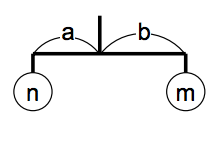
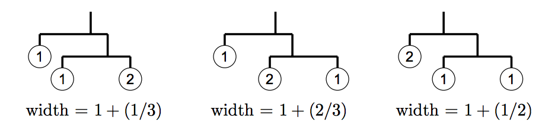
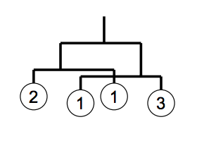

## 문제

There is a mysterious planet called Yaen, whose space is 2-dimensional. There are many beautiful stones on the planet, and the Yaen people love to collect them. They bring the stones back home and make nice mobile arts of them to decorate their 2-dimensional living rooms.

In their 2-dimensional world, a mobile is defined recursively as follows:

* a stone hung by a string, or
* a rod of length 1 with two sub-mobiles at both ends; the rod is hung by a string at the center of gravity of sub-mobiles. When the weights of the sub-mobiles are n and m, and their distances from the center of gravity are a and b respectively, the equation n × a = m × b holds.

For example, if you got three stones with weights 1, 1, and 2, here are some possible mobiles and their widths:



Given the weights of stones and the width of the room, your task is to design the widest possible mobile satisfying both of the following conditions.

* It uses all the stones.
* Its width is less than the width of the room.

You should ignore the widths of stones.

In some cases two sub-mobiles hung from both ends of a rod might overlap (see the figure on the right). Such mobiles are acceptable. The width of the example is (1/3) + 1 + (1/4).

## 입력

The first line of the input gives the number of datasets. Then the specified number of datasets follow. A dataset has the following format.

```

r
s
w1
.
.
.
ws
```

r is a decimal fraction representing the width of the room, which satisfies 0 <r< 10. s is the number of the stones. You may assume 1 ≤ s ≤ 6. wi is the weight of the i-th stone, which is an integer. You may assume 1 ≤ wi ≤ 1000.

You can assume that no mobiles whose widths are between r − 0.00001 and r + 0.00001 can be made of given stones.

## 출력

For each dataset in the input, one line containing a decimal fraction should be output. The decimal fraction should give the width of the widest possible mobile as defined above. An output line should not contain extra characters such as spaces.

In case there is no mobile which satisfies the requirement, answer −1 instead.

The answer should not have an error greater than 0.00000001. You may output any number of digits after the decimal point, provided that the above accuracy condition is satisfied
