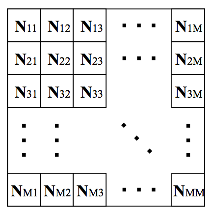
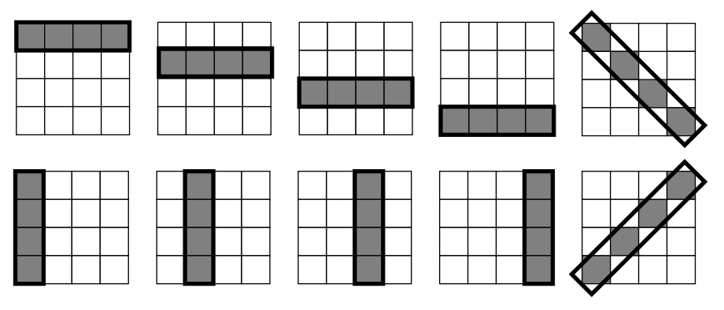
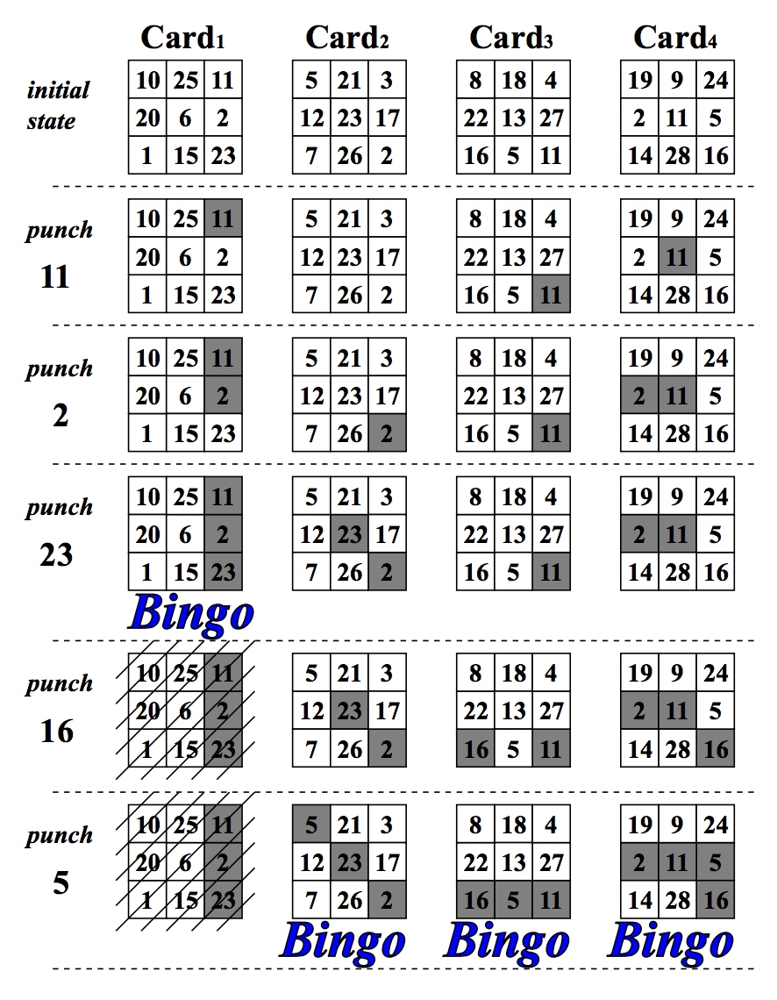

## 문제

A Bingo game is played by one gamemaster and several players. At the beginning of a game, each player is given a card with M × M numbers in a matrix (See Figure 10).



Figure 10: A Card



Figure 11: Bingo patterns of 4×4 card

As the game proceeds, the gamemaster announces a series of numbers one by one. Each player punches a hole in his card on the announced number, if any.

When at least one ‘Bingo’ is made on the card, the player wins and leaves the game. The ‘Bingo’ means that all the M numbers in a line are punched vertically, horizontally or diagonally (See Figure 11).



Figure 12: Example of Bingo Game Process

The gamemaster continues announcing numbers until all the players make a Bingo.

In the ordinary Bingo games, the gamemaster chooses numbers by a random process and has no control on them. But in this problem the gamemaster knows all the cards at the beginning of the game and controls the game by choosing the number sequence to be announced at his will.

Specifically, he controls the game to satisfy the following condition.

> Cardi makes a Bingo no later than Cardj , for i<j. (∗)

Figure 12 shows an example of how a game proceeds. The gamemaster cannot announce ‘5’ before ‘16’, because Card4 makes a Bingo before Card2 and Card3, violating the condition (∗).

Your job is to write a program which finds the minimum length of such sequence of numbers for the given cards.

## 입력

The input consists of multiple datasets. The format of each dataset is as follows.

```

P M
N111 N112 ... N11M N121 N122 ... N12M ... N1M1 N1M2 ... N1MM
N211 N212 ... N21M N221 N222 ... N22M ... N2M1 N2M2 ... N2MM
.
.
.
NP11 NP12 ... NP1M NP21 NP22 ... NP2M ... NPM1 NPM2 ... NPMM
```

All data items are integers. P is the number of the cards, namely the number of the players. M is the number of rows and the number of columns of the matrix on each card. Nkij means the number written at the position (i, j) on the k-th card. If (i, j) = (p, q), then Nkij = Nkpq. The parameters P, M, and N satisfy the conditions 2 ≤ P ≤ 4, 3 ≤ M ≤ 4, and 0 ≤ Nkij ≤ 99.

The end of the input is indicated by a line containing two zeros separated by a space. It is not a dataset.

## 출력

For each dataset, output the minimum length of the sequence of numbers which satisfy the condition (∗). Output a zero if there are no such sequences. Output for each dataset must be printed on a separate line.
