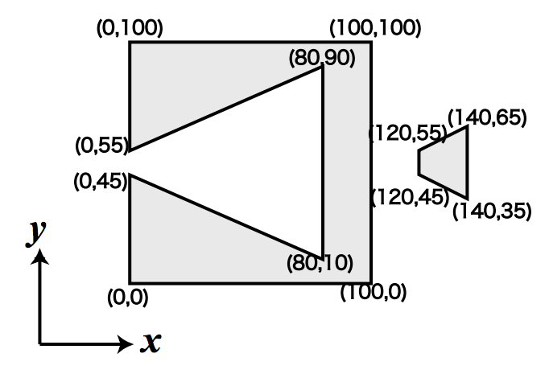
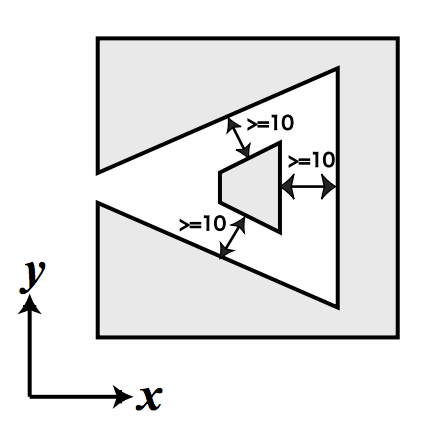

## 문제

You are given two solid polygons and their positions on the xy-plane. You can move one of the two along the x-axis (they can overlap during the move). You cannot move it in other directions. The goal is to place them as compactly as possible, subject to the following condition: the distance between any point in one polygon and any point in the other must not be smaller than a given minimum distance L.

We define the width of a placement as the difference between the maximum and the minimum x-coordinates of all points in the two polygons.

Your job is to write a program to calculate the minimum width of placements satisfying the above condition.

Let’s see an example. If the polygons in Figure 13 are placed with L = 10.0, the result will be 100. Figure 14 shows one of the optimal placements.



Figure 13: Initial position of the two polygons

## 입력

The input consists of multiple datasets. Each dataset is given in the following format.

```

L
Polygon1
Polygon2
```



Figure 14: One of the optimal placements (L = 10.0)

L is a decimal fraction, which means the required distance of two polygons. L is greater than 0.1 and less than 50.0.

The format of each polygon is as follows.

```

n
x1 y1
x2 y2
.
.
.
xn yn
```

n is a positive integer, which represents the number of vertices of the polygon. n is greater than 2 and less than 15.

Remaining lines represent the vertices of the polygon. A vertex data line has a pair of nonnegative integers which represent the x- and y-coordinates of a vertex. x- and y-coordinates are separated by a single space, and y-coordinate is immediately followed by a newline. x and y are less than 500.

Edges of the polygon connect vertices given in two adjacent vertex data lines, and vertices given in the last and the first vertex data lines. You may assume that the vertices are given in the counterclockwise order, and the contours of polygons are simple, i.e. they do not cross nor touch themselves.

Also, you may assume that the result is not sensitive to errors. In concrete terms, for a given pair of polygons, the minimum width is a function of the given minimum distance l. Let us denote the function w(l). Then you can assume that |w(L ± 10−7) − w(L)| < 10−4.

The end of the input is indicated by a line that only contains a zero. It is not a part of a dataset.

## 출력

The output should consist of a series of lines each containing a single decimal fraction. Each number should indicate the minimum width for the corresponding dataset. The answer should not have an error greater than 0.0001. You may output any number of digits after the decimal point, provided that the above accuracy condition is satisfied.
