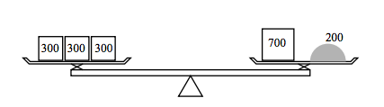
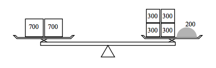

## 문제

원웅이는 두 종류의 추와 저울을 이용해서 아스피린의 양을 재려고 한다. 원웅이는 추를 무수히 많이 가지고 있고, 약은 가루로 가지고 있다.

예를 들어, 300mg 추와 700mg 추가 있을 때, 200mg의 아스피린을 재려면, 300mg 추 3개를 왼편에 놓고, 700mg의 추 1개를 반대편에 놓은 뒤, 평형을 이루도록 약을 놓으면 된다.

또는, 왼쪽에 700mg 추 2개를 놓고, 오른쪽에 300mg추 4개를 놓으면, 오른쪽에 약을 저울이 평형을 이루도록 놓으면 된다.

원웅이가 가지고 있는 추의 종류와 재려고 하는 아스피린의 양이 주어졌을 때, 각각 추를 몇 개 사용하면 아스피린의 양을 잴 수 있는지 구하는 프로그램을 작성하시오.

## 입력

입력은 여러 개의 테스트 케이스로 이루어져 있다. 각 테스트 케이스는 한 줄로 이루어져 있고, a, b, d가 공백으로 구분되어 주어진다.

a와 b는 원웅이가 가지고 있는 추의 무게이고, d는 재려고 하는 약의 양이다. a와 b는 같지 않고, 두 수 모두 10,00보다 작거나 같은 자연수이다. d는 50,000보다 작거나 같은 자연수이다.

정답이 존재하지 않는 경우는 없다.

테스트 케이스는 a, b, d가 0일 때 끝난다.

## 출력

각 테스트 케이스에 대해서, x와 y를 출력한다. x와 y는 다음 세가지 조건을 만족해야 한다.

1. amg추 x개와 bmg추 y개를 이용해서 dmg의 약을 저울로 잴 수 있어야 한다.

2. 1번 조건을 만족하는 경우가 여러 가지라면, 사용한 추의 개수(x+y)가 가장 작은 것을 출력한다.

3. 2번 조건을 만족하는 경우도 여러 가지라면, 추의 총 질량(ax+by)이 가장 작은 것을 출력한다.
