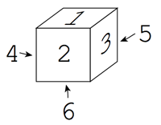
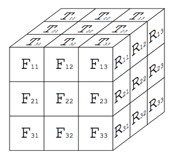
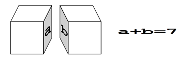
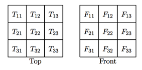
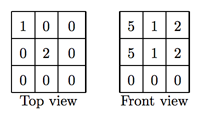
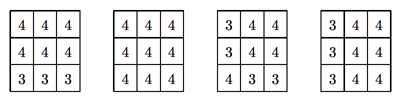

## 문제

Let’s try a dice puzzle. The rules of this puzzle are as follows.

1. Dice with six faces as shown in Figure 6 are used in the puzzle.



Figure 6: Faces of a die

2. With twenty seven such dice, a 3 × 3 × 3 cube is built as shown in Figure 7.



Figure 7: 3 × 3 × 3 cube

3. When building up a cube made of dice, the sum of the numbers marked on the faces of adjacent dice that are placed against each other must be seven (See Figure 8). For example, if one face of the pair is marked “2”, then the other face must be “5”.



Figure 8: A pair of faces placed against each other

4. The top and the front views of the cube are partially given, i.e. the numbers on faces of some of the dice on the top and on the front are given.



Figure 9: Top and front views of the cube

5. The goal of the puzzle is to find all the plausible dice arrangements that are consistent with the given top and front view information.

Your job is to write a program that solves this puzzle.

## 입력

The input consists of multiple datasets in the following format.

```

N
Dataset1
Dataset2
...
DatasetN
```

N is the number of the datasets.

The format of each dataset is as follows.

```

T11 T12 T13
T21 T22 T23
T31 T32 T33
F11 F12 F13
F21 F22 F23
F31 F32 F33
```

Tij and Fij (1 ≤ i ≤ 3, 1 ≤ j ≤ 3) are the faces of dice appearing on the top and front views, as shown in Figure 7, or a zero. A zero means that the face at the corresponding position is unknown.

## 출력

For each plausible arrangement of dice, compute the sum of the numbers marked on the nine faces appearing on the right side of the cube, that is, with the notation given in Figure 7, \(\sum\_{i=1}^{3}\sum\_{j=1}^{3}R\_{ij}\).

For each dataset, you should output the right view sums for all the plausible arrangements, in ascending order and without duplicates. Numbers should be separated by a single space.

When there are no plausible arrangements for a dataset, output a zero.

For example, suppose that the top and the front views are given as follows.



Figure 10: Example

There are four plausible right views as shown in Figure 11. The right view sums are 33, 36, 32, and 33, respectively. After rearranging them into ascending order and eliminating duplicates, the answer should be “32 33 36”.



Figure 11: Plausible right views

The output should be one line for each dataset. The output may have spaces at ends of lines.
