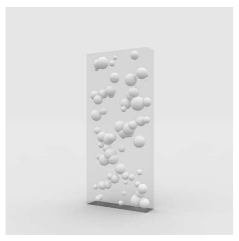
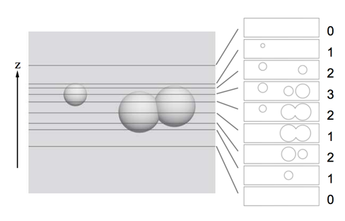

## 문제

In the year 2xxx, an expedition team landing on a planet found strange objects made by an ancient species living on that planet. They are transparent boxes containing opaque solid spheres (Figure 12). There are also many lithographs which seem to contain positions and radiuses of spheres.

Figure 12: A strange object

Initially their objective was unknown, but Professor Zambendorf found the cross section formed by a horizontal plane plays an important role. For example, the cross section of an object changes as in Figure 13 by sliding the plane from bottom to top.

Figure 13: Cross sections at different positions

He eventually found that some information is expressed by the transition of the number of connected figures in the cross section, where each connected figure is a union of discs intersecting or touching each other, and each disc is a cross section of the corresponding solid sphere. For instance, in Figure 13, whose geometry is described in the first sample dataset later, the number of connected figures changes as 0, 1, 2, 1, 2, 3, 2, 1, and 0, at z = 0.0000, 162.0000, 167.0000, 173.0004, 185.0000, 191.9996, 198.0000, 203.0000, and 205.0000, respectively. By assigning 1 for increment and 0 for decrement, the transitions of this sequence can be expressed by an 8-bit binary number 11011000.

For helping further analysis, write a program to determine the transitions when sliding the horizontal plane from bottom (z = 0) to top (z = 36000).

## 입력

The input consists of a series of datasets. Each dataset begins with a line containing a positive integer, which indicates the number of spheres N in the dataset. It is followed by N lines describing the centers and radiuses of the spheres. Each of the N lines has four positive integers Xi, Yi, Zi, and Ri (i = 1, ··· , N) describing the center and the radius of the i-th sphere, respectively.

You may assume 1 ≤ N ≤ 100, 1 ≤ Ri ≤ 2000, 0 < Xi − Ri < Xi + Ri < 4000, 0 < Yi − Ri < Yi + Ri < 16000, and 0 < Zi − Ri < Zi + Ri < 36000. Each solid sphere is defined as the set of all points (x, y, z) satisfying (x − Xi)2 + (y − Yi)2 + (z − Zi)2 ≤ Ri2.

A sphere may contain other spheres. No two spheres are mutually tangent. Every Zi ± Ri and minimum/maximum z coordinates of a circle formed by the intersection of any two spheres differ from each other by at least 0.01.

The end of the input is indicated by a line with one zero.

## 출력

For each dataset, your program should output two lines. The first line should contain an integer M indicating the number of transitions. The second line should contain an M-bit binary number that expresses the transitions of the number of connected figures as specified above.
