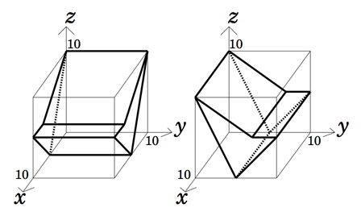
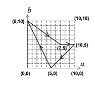
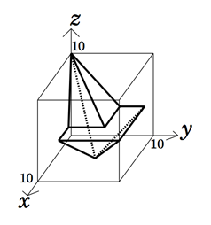

## 문제

Prof. Bocchan is a mathematician and a sculptor. He likes to create sculptures with mathematics.

His style to make sculptures is very unique. He uses two identical prisms. Crossing them at right angles, he makes a polyhedron that is their intersection as a new work. Since he finishes it up with painting, he needs to know the surface area of the polyhedron for estimating the amount of pigment needed.

For example, let us consider the two identical prisms in Figure 14. The definition of their cross section is given in Figure 15. The prisms are put at right angles with each other and their intersection is the polyhedron depicted in Figure 16. An approximate value of its surface area is 194.8255.

Figure 14: Two identical prisms at right angles

Given the shape of the cross section of the two identical prisms, your job is to calculate the surface area of his sculpture.

## 입력

The input consists of multiple datasets, followed by a single line containing only a zero. The first line of each dataset contains an integer n indicating the number of the following lines, each of which contains two integers ai and bi (i = 1, ··· , n).

Figure 15: Outline of the cross section

Figure 16: The intersection

A closed path formed by the given points (a1, b1), (a2, b2), ···, (an, bn), (an+1, bn+1)(= (a1, b1)) indicates the outline of the cross section of the prisms. The closed path is simple, that is, it does not cross nor touch itself. The right-hand side of the line segment from (ai, bi) to (ai+1, bi+1) is the inside of the section.

You may assume that 3 ≤ n ≤ 4, 0 ≤ ai ≤ 10 and 0 ≤ bi ≤ 10 (i = 1, ··· , n).

One of the prisms is put along the x-axis so that the outline of its cross section at x = ξ is indicated by points (xi, yi, zi) = (ξ, ai, bi) (0 ≤ ξ ≤ 10, i = 1, ··· , n). The other prism is put along the y-axis so that its cross section at y = η is indicated by points (xi, yi, zi) = (ai, η, bi) (0 ≤ η ≤ 10, i = 1, ··· , n).

## 출력

The output should consist of a series of lines each containing a single decimal fraction. Each number should indicate an approximate value of the surface area of the polyhedron defined by the corresponding dataset. The value may contain an error less than or equal to 0.0001. You may print any number of digits below the decimal point.
