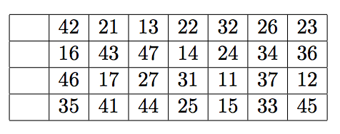
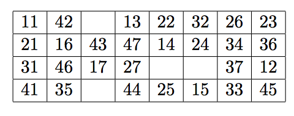
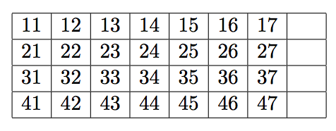

## 문제

Let’s play a card game called Gap.

You have 28 cards labeled with two-digit numbers. The first digit (from 1 to 4) represents the suit of the card, and the second digit (from 1 to 7) represents the value of the card.

First, you shuffle the cards and lay them face up on the table in four rows of seven cards, leaving a space of one card at the extreme left of each row. The following shows an example of initial layout.

Next, you remove all cards of value 1, and put them in the open space at the left end of the rows: “11” to the top row, “21” to the next, and so on.

Now you have 28 cards and four spaces, called gaps, in four rows and eight columns. You start moving cards from this layout.

At each move, you choose one of the four gaps and fill it with the successor of the left neighbor of the gap. The successor of a card is the next card in the same suit, when it exists. For instance the successor of “42” is “43”, and “27” has no successor.

In the above layout, you can move “43” to the gap at the right of “42”, or “36” to the gap at the right of “35”. If you move “43”, a new gap is generated to the right of “16”. You cannot move any card to the right of a card of value 7, nor to the right of a gap.

The goal of the game is, by choosing clever moves, to make four ascending sequences of the same suit, as follows.

Your task is to find the minimum number of moves to reach the goal layout.

## 입력

The input starts with a line containing the number of initial layouts that follow.

Each layout consists of five lines — a blank line and four lines which represent initial layouts of four rows. Each row has seven two-digit numbers which correspond to the cards.

## 출력

For each initial layout, produce a line with the minimum number of moves to reach the goal layout. Note that this number should not include the initial four moves of the cards of value 1. If there is no move sequence from the initial layout to the goal layout, produce “-1”.
